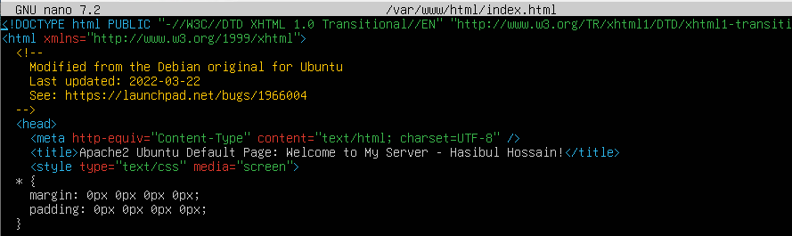
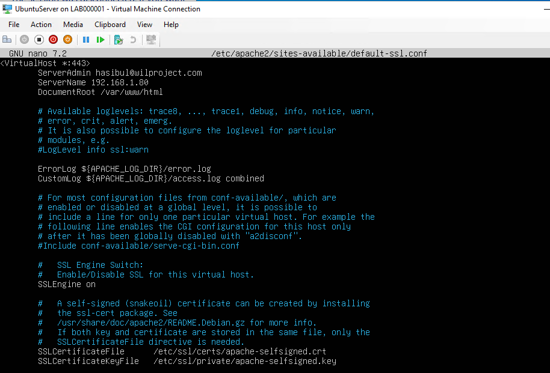
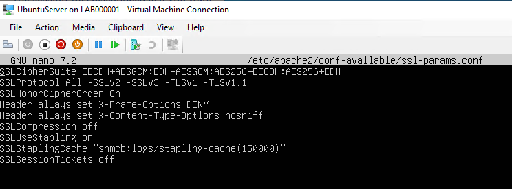
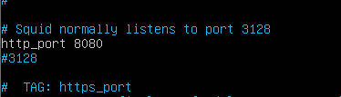
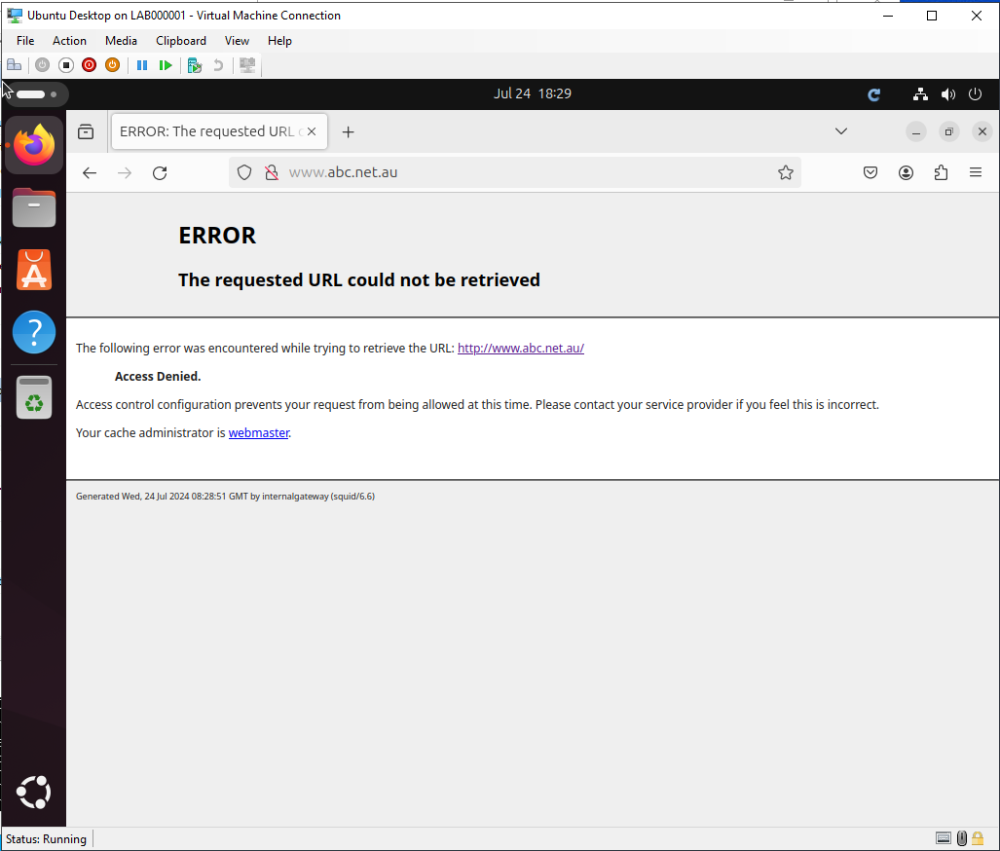
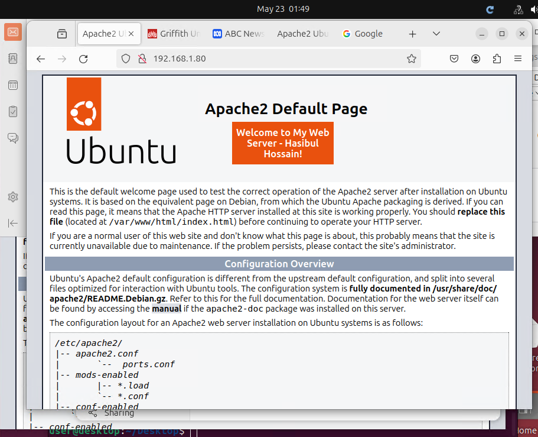

# Cybersecurity-Operations-SOC-
## Activity 1: DMZ Network Setup

**Purpose:** Establish the foundational network infrastructure that all subsequent activities depend on.

**What was built:** Four Ubuntu 22.04 LTS virtual machines were provisioned within Hyper-V on Microsoft Azure and connected across three isolated network segments, forming the segmented lab topology required for the entire project.

| **VM** | **Role** | **Network Segment** |
| --- | --- | --- |
| ExternalGateway | Border router and NAT gateway | ExternalNetwork + DMZNetwork |
| InternalGateway | Internal router and DNS/VPN host | DMZNetwork + InternalNetwork |
| UbuntuServer | Service host (web, email, DNS) | DMZNetwork |
| UbuntuDesktop | Client machine for testing | InternalNetwork |

**Configuration steps:**

- Static IP addresses assigned to all VMs via netplan


- IP forwarding enabled on both gateway VMs 

```
net.ipv4.ip_forward=1 in /etc/sysctl.conf
```


- NAT configured on ExternalGateway using iptables MASQUERADE on eth0, allowing all internal VMs to reach the internet through the gateway's public IP

```
sudo iptables -t nat -A POSTROUTING -o eth0 -j MASQUERADE
```

**Verification:** All VMs successfully pinged each other across segments, and internet access was confirmed from UbuntuDesktop by loading the Griffith University website in a browser.


**Key services:** Hyper-V virtual switches, Netplan, IP forwarding, iptables MASQUERADE **Running on:** ExternalGateway and InternalGateway

-

## Activity 2.1: Secure Web Server

**Purpose:** Deploy a production-style HTTPS web server with encrypted traffic and controlled proxy access for internal clients.

**What was built:** Apache2 was installed on UbuntuServer (192.168.1.80) and configured to serve web content over both HTTP and HTTPS. A Squid forwarding proxy was installed on InternalGateway to manage and control outbound web access for internal network clients.

| Component | Detail |
| --- | --- |
| Web server | Apache2 on UbuntuServer (192.168.1.80) |
| Certificate | Self-signed, 2048-bit RSA, 365 days (OpenSSL) |
| Protocol | HTTPS port 443, TLS 1.2 minimum |
| Proxy | Squid on InternalGateway, port 8080 |

**Configuration steps:**

- Apache2 installed and custom web page created at /var/www/html/index.html



- Self-signed TLS certificate generated using OpenSSL and applied to Apache2 via default-ssl.conf



- Strong cipher suites enforced and legacy protocols (SSLv2, SSLv3, TLS 1.0/1.1) disabled in ssl-params.conf



- Squid installed on InternalGateway and configured to listen on port 8080 as a forwarding proxy



- Squid proxy configured to permit internal network requests only and block Australian websites during office hours (9am–5pm)



**Verification:** The web page was confirmed loading over both http://192.168.1.80 and https://192.168.1.80 in a browser on UbuntuDesktop. HTTPS traffic was captured on port 443, confirming the payload was encrypted. Squid access logs confirmed web pages were being cached and the Australian website block was active during office hours.



**Key services:** Apache2, OpenSSL (TLS 1.2+), Squid proxy (port 8080)

**Running on:** UbuntuServer (192.168.1.80) and InternalGateway (192.168.1.1)

