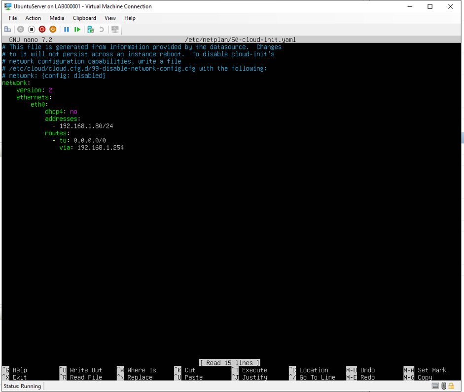
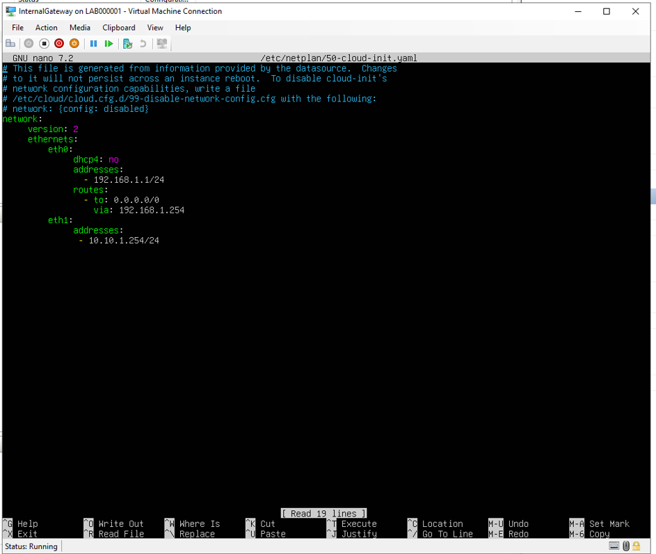
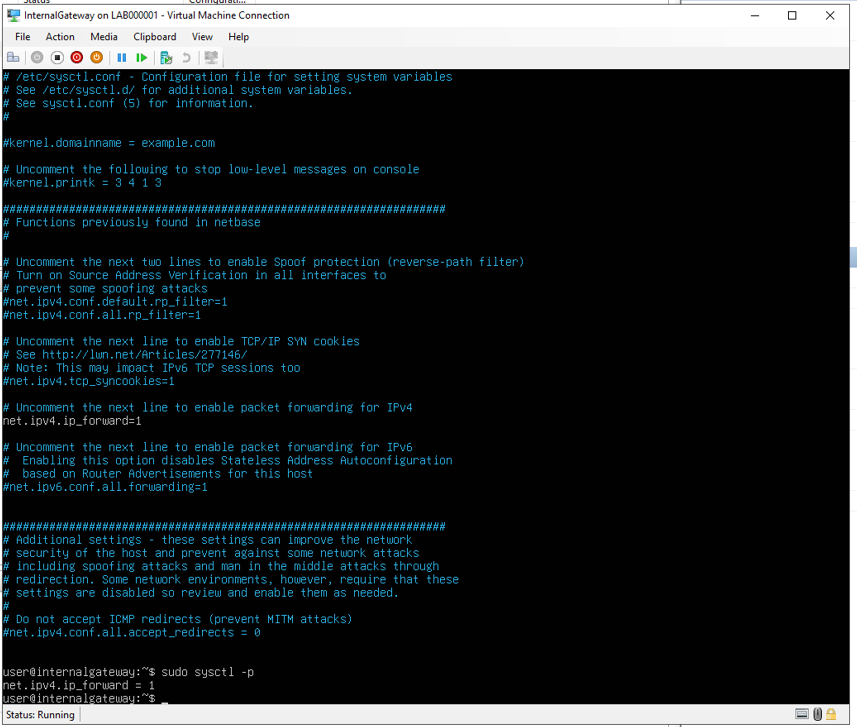
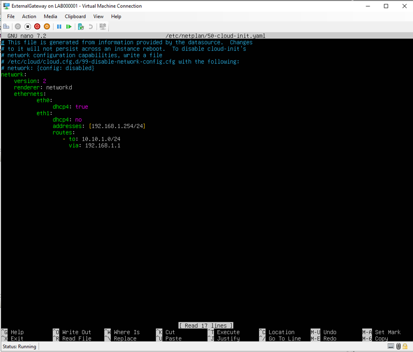

# Cybersecurity-Operations-SOC-
## Activity 1: DMZ Network Setup

**Purpose:** Establish the foundational network infrastructure that all subsequent activities depend on.

**What was built:** Four Ubuntu 22.04 LTS virtual machines were provisioned within Hyper-V on Microsoft Azure and connected across three isolated network segments, forming the segmented lab topology required for the entire project.

| **VM** | **Role** | **Network Segment** |
| --- | --- | --- |
| ExternalGateway | Border router and NAT gateway | ExternalNetwork + DMZNetwork |
| InternalGateway | Internal router and DNS/VPN host | DMZNetwork + InternalNetwork |
| UbuntuServer | Service host (web, email, DNS) | DMZNetwork |
| UbuntuDesktop | Client machine for testing | InternalNetwork |

**Configuration steps:**

- Static IP addresses assigned to all VMs via netplan







- IP forwarding enabled on both gateway VMs (net.ipv4.ip_forward=1 in /etc/sysctl.conf)



- NAT configured on ExternalGateway using iptables MASQUERADE on eth0, allowing all internal VMs to reach the internet through the gateway's public IP

```
sudo iptables -t nat -A POSTROUTING -o eth0 -j MASQUERADE
```

**Verification:** All VMs successfully pinged each other across segments, and internet access was confirmed from UbuntuDesktop by loading the Griffith University website in a browser.


**Key services:** Hyper-V virtual switches, Netplan, IP forwarding, iptables MASQUERADE **Running on:** ExternalGateway and InternalGateway
